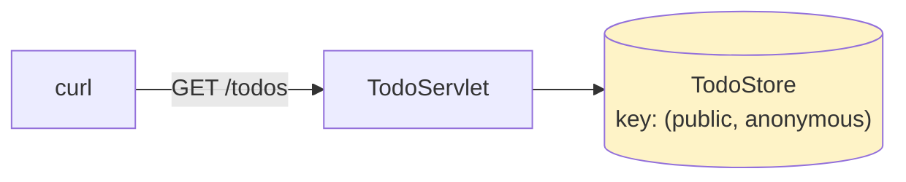
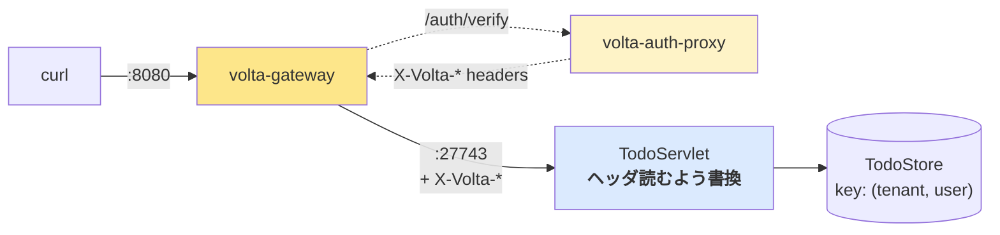

# 00 — 現状確認: 認証なしで todo-sample を触る

## 対話

> **後輩**「これから todo-sample に認証を入れます。volta-gateway と volta-auth-proxy 使う、と聞いてますが、その前に**今どう動いてるか**を確認したいです。」

> **先輩**「いい入り方だ。Before 状態を見ずに変更を加えるな、って前にも言ったやつだな。`README.md` をまず読め。」

> **後輩**「読みました。`mvn jetty:run` で `:27743` に立つ。`tenant=public, user=anonymous` の固定値で動く、と。」

> **先輩**「そう。**書き換えるのは 2 行だけ** ってのが売り。`TodoServlet#service` の冒頭。そこを後で触る。」

## 触ってみる

```bash
cd todo-sample
mvn jetty:run
# 別ターミナルで:
curl -s -d '{"title":"買い物"}' -H 'Content-Type: application/json' \
     http://localhost:27743/todos
# => {"id":1,"title":"買い物","done":false,"createdAt":...}

curl -s http://localhost:27743/todos
# => [{"id":1,...}]
```

> **後輩**「あれ、`X-Volta-User-Id: alice` を付けても結果同じですね。」

> **先輩**「当然。今はヘッダを読んでない。だから誰が叩いても `(public, anonymous)` バケットに落ちる。**それが今日変わる**。」

## 現状のフロー



シンプル。シンプル過ぎる。**全員が同じバケットを共有してる**。

## ここから変えるもの



変更ポイントは 3 箇所:
1. **TodoServlet**: ハードコードをヘッダ読みに (2 行)
2. **volta-auth-proxy**: 起動 (本物は別途、本記録は mock で代用)
3. **volta-gateway**: YAML 1 つ書いて起動

> **後輩**「アプリのコード変更が 2 行だけって、本当ですか? 認証って普通もっと侵襲的じゃないですか?」

> **先輩**「**proxy パターン** だからな。アプリは認証の存在を知らない。"前で誰かがヘッダ付けてくれる" 前提で動く。これを進めると `01-アーキテクチャ決定.md` の話になる。」

## 次

→ [01-アーキテクチャ決定.md](01-アーキテクチャ決定.md)
