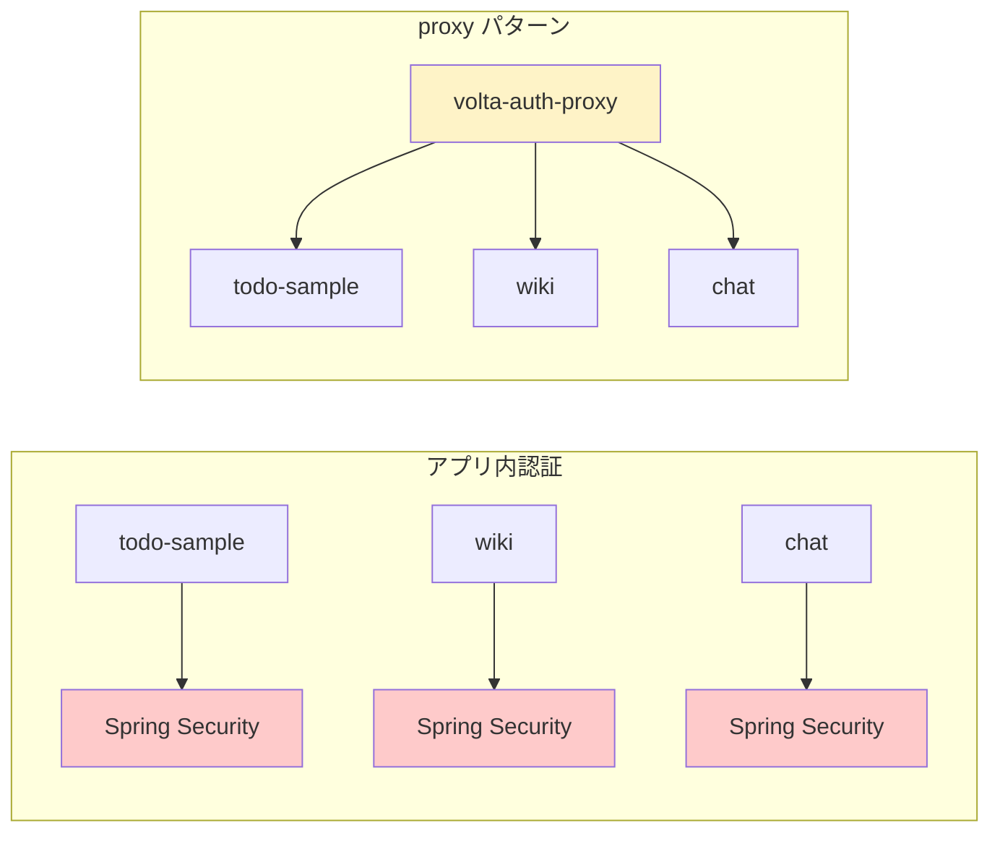
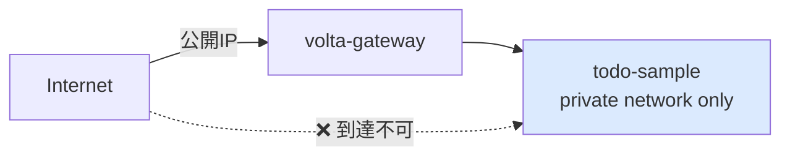

# 01 — アーキテクチャ決定: なぜ proxy パターンか

## 対話

> **後輩**「素朴な疑問なんですが、Spring Security とか入れて `@PreAuthorize` 書いていく方が普通じゃないですか?」

> **先輩**「**普通** ではあるな。それも選択肢。ただ今回は **アプリ側に認証コードを 1 行も書きたくない**。」

> **後輩**「なんでです?」

> **先輩**「3つ理由がある。」

### 1. 認証ロジックが全アプリに散る問題



- アプリ内認証: OIDC の library upgrade が **N アプリ分** 発生する
- proxy パターン: アプリは **ただヘッダを読むだけ**。認証 library 入れない

### 2. 言語非依存

> **後輩**「volta-auth-proxy って Java ですよね?」

> **先輩**「そう、本物は Java。だが **proxy なので backend は何でもいい**。今回の todo-sample は Java だけど、Node でも Go でも Python でも同じ。ヘッダさえ読めば。」

### 3. アプリは認可に集中

```
認証 (authn) = 誰?              → proxy が判定
認可 (authz) = この人に許す?     → アプリのビジネスロジック
```

> **後輩**「`role == ADMIN` なら削除OK、みたいな?」

> **先輩**「そう。それは business logic だからアプリ側。proxy に吸い込ませない。」

## ヘッダ信頼モデル

> **後輩**「あの、`curl -H "X-Volta-User-Id: admin"` で偽装し放題じゃないですか?」

> **先輩**「**直接 backend を叩かれたら詰む**。だからこうする:」



- **gateway を唯一の入口** にする (Cloudflare → gateway → backend)
- backend は private network 内にだけ置く
- gateway が **必ず X-Volta-\* を strip して再生成** する (gateway 側のコード抜粋):

```rust
// gateway/src/proxy.rs より
.filter(|k| k.as_str().starts_with("x-volta-"))   // クライアントが付けた x-volta-* は捨てる
```

- proxy 通った後だけ X-Volta-\* が付いている = **アプリはヘッダを信用していい**

ローカル開発では `curl -H "X-Volta-User-Id: alice"` でテストする (= proxy のフリ)。
本番ではネットワーク構成で保証する。

## なぜ volta-gateway か (Traefik じゃなくて)

> **後輩**「ForwardAuth なら Traefik でも同じことできますよね。」

> **先輩**「できる。読んでみろ:」

引用 (`volta-gateway/README-ja.md` より):

> 大規模 (50+ サービス, Kubernetes, Canary): Traefik + volta-auth-proxy の ForwardAuth を推奨。
> 中小規模 SaaS (5-20 サービス, 認証レイテンシ重視): volta-gateway なら認証チェック 5-10倍速、ステップ別可視化、YAML 1ファイル設定。

> **先輩**「今回は **5 サービス未満の SaaS** 想定。だから volta-gateway。実測 6.6倍速いのと、YAML 1個で全部書けるのが効く。」

## 決定事項

| 項目 | 決定 | 理由 |
|---|---|---|
| 認証方式 | proxy パターン | アプリにコード書きたくない |
| proxy 実装 | volta-gateway (Rust) | 小規模 SaaS で低レイテンシ |
| 認証 backend | volta-auth-proxy | (今回は mock_auth example で代用) |
| アプリ変更 | 2 行のみ | `TodoServlet#service` の冒頭 |
| 偽装防止 | network 分離 + gateway strip | ヘッダ信頼モデル |

## 次

→ [02-todo-sample書き換え.md](02-todo-sample書き換え.md)
