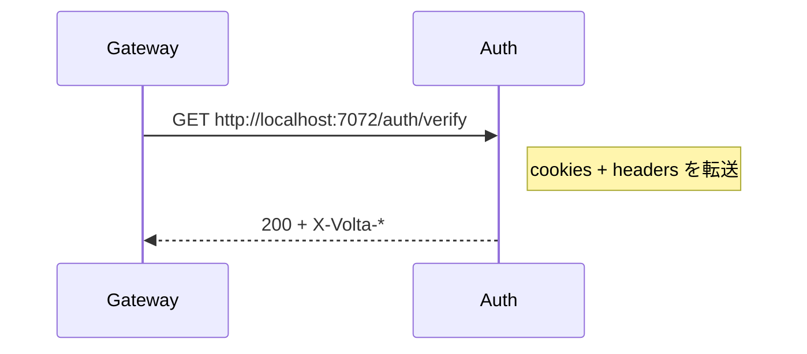

# 04 — volta-gateway 設定: YAML 1 ファイル

## 対話

> **後輩**「Traefik だと labels や middleware chain で…」

> **先輩**「volta-gateway は **YAML 1 個** が売り。読みづらかったら設計が悪い、ってスタンスらしい。」

> **後輩**「最小はどんなの?」

> **先輩**「`volta-gateway.minimal.yaml` 見ろ。server / auth / routing の 3 ブロックだけ。あとはデフォルト。」

## 用意した設定

`auth-integration/todo-gateway.yaml`:

```yaml
server:
  port: 8888                           # :8080 は他のアプリで使用中だったので 8888

auth:
  volta_url: http://localhost:7072     # mock_auth (本物 volta-auth-proxy は :7070 で別に動いてた)
  verify_path: /auth/verify
  timeout_ms: 500                      # fail-closed
  pool_max_idle: 32

routing:
  - host: localhost
    backend: http://localhost:7743     # todo-sample
    app_id: app-todo

rate_limit:
  requests_per_second: 100

healthcheck:
  interval_secs: 30
  path: /healthz

logging:
  level: info
  format: pretty
```

## 各ブロックの意味

### server.port

外から見える唯一のポート。今後の curl は全部 `http://localhost:8888` に投げる。
(デフォは :8080 だが、本環境では :8080 が他のアプリ (node の netmahg) で取られていたので避けた)

### auth.volta_url + verify_path



- `volta_url` + `verify_path` で `http://localhost:7072/auth/verify` を組み立てる
- これは ForwardAuth とほぼ同じパターン。違いは**コネクションプール持ってる**ところ
  (Traefik ForwardAuth は毎回 2 ホップ。volta-gateway は keepalive で再利用)

### auth.timeout_ms: 500 (fail-closed)

> **後輩**「これ大事ですか?」

> **先輩**「**死活問題**。500ms 過ぎたら 502 を返す。
> "認証側が応答しないからとりあえず通しちゃえ" は **絶対やってはいけない**。
> volta-gateway はデフォで fail-closed。これは安心。」

### routing.host: localhost

ハンズオンなので localhost で受ける。本番は `app.example.com` とかになる。
ワイルドカード (`*.example.com`) も書ける。

### routing.backend: http://localhost:7743

todo-sample の Jetty が listen してるポート。

### app_id: app-todo

backend に `X-Volta-App-Id: app-todo` として渡る。マルチアプリ環境で
「どのアプリに来たリクエストか」を auth-proxy 側で見るための ID。今回は気にしなくていい。

## 検証 (起動前)

```bash
./volta-gateway/target/release/volta-gateway --validate auth-integration/todo-gateway.yaml
```

設定 typo は起動前に弾ける。CI に組み込む価値あり。

## 起動

```bash
./volta-gateway/target/release/volta-gateway auth-integration/todo-gateway.yaml &
```

> **後輩**「順番ありますか?」

> **先輩**「**先に backend と auth を立ててから gateway**。逆だと healthcheck で先にエラーログ出る。
> 起動順は次の章で詳しくやる。」

## 設定で意図的に省いたもの

| 項目 | 省いた理由 |
|---|---|
| `tls` | localhost ハンズオンなので HTTP のみ |
| `cors_origins` | 同一オリジン (curl) なので不要 |
| `auth_bypass_paths` | 今回は全パス認証ありで OK |
| `backend_pool` | デフォルトで十分 |

本番に出すときは TLS と CORS は必須。 → `06-振り返り.md` で触れる。

## 次

→ [05-疎通確認.md](05-疎通確認.md)
