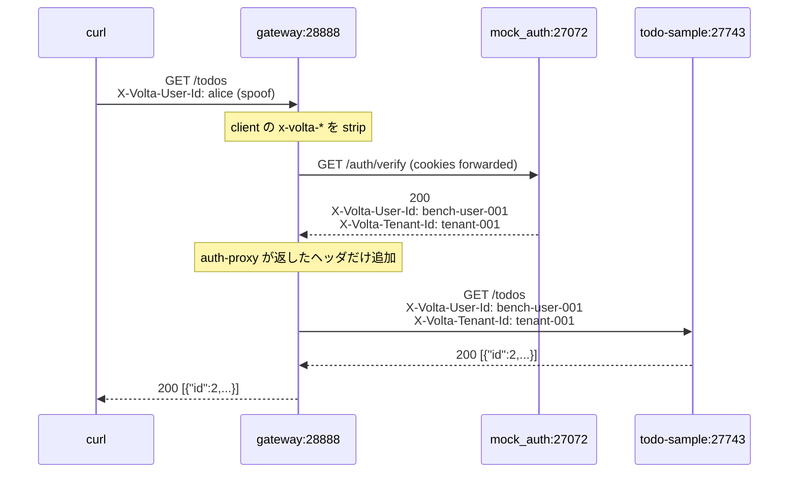

# 05 — 疎通確認: 3 プロセスで end-to-end

## 対話

> **後輩**「ようやく起動しますね。順番は?」

> **先輩**「backend → 認証 → gateway。**gateway が一番最後**。逆だと healthcheck で
> 起動直後にエラーログ出る。」

## 起動手順 (実際の実行ログ込み)

### 1. mock_auth (本物 volta-auth-proxy の代わり)

```bash
./volta-gateway/target/release/examples/mock_auth 27072 &
# => mock auth listening on 127.0.0.1:27072
```

> **後輩**「あれ、設定は 27070 じゃなかったでしたっけ?」

> **先輩**「**本物の volta-auth-proxy がすでに :27070 で動いてた** ので、mock は 27072 に避けた。
> 本物は `java -jar volta-auth-proxy-0.3.0-SNAPSHOT.jar`、`local-bypass` モードで動いていた。
> 配管確認には mock の方が都合がいい (X-Volta-* を必ず付けてくれる)。」

実行環境のスナップショット:

```
$ ss -tlnp | grep -E ':27070|:27072|:27743|:28888'
*:27070   java (本物の volta-auth-proxy)
:27072    mock_auth (今回の認証 backend)
*:27743   java (todo-sample Jetty)
:28888    volta-gateway
```

### 2. todo-sample (Jetty)

```bash
cd todo-sample
mvn -q jetty:run &
# Jetty が http://localhost:27743 で listen
```

### 3. volta-gateway

```bash
./volta-gateway/target/release/volta-gateway auth-integration/todo-gateway.yaml &
# {"message":"listening","addr":"0.0.0.0:28888"}
```

> **先輩**「**:8080 も他のアプリで取られてた** ので :28888 に振った。設定はその通り。」

## 疎通テスト

### テスト 1: 直接 backend を叩く (認証なし)

```bash
$ curl -s -d '{"title":"直接叩く"}' -H 'Content-Type: application/json' \
       http://localhost:27743/todos
{"id":1,"title":"直接叩く","done":false,"createdAt":1779663766533}
```

ヘッダ無し → `(public, anonymous)` バケットに落ちる。**これは旧挙動と同じ**。

### テスト 2: gateway 経由

```bash
$ curl -s -d '{"title":"gateway経由"}' -H 'Content-Type: application/json' \
       http://localhost:28888/todos
{"id":2,"title":"gateway経由","done":false,"createdAt":1779663766562}

$ curl -s http://localhost:28888/todos
[{"id":2,"title":"gateway経由","done":false,"createdAt":1779663766562}]
```

> **後輩**「id=1 が見えない! gateway 経由だと別バケットなんですね。」

> **先輩**「そう。mock\_auth が返した `tenant-001 / bench-user-001` バケットに入ってる。
> 直叩きの `public / anonymous` とは完全に分離されてる。」

gateway ログがそれを裏付ける:

```json
{"state":"ACCESS","method":"POST","host":"localhost","path":"/todos",
 "status":201,"latency_ms":2.424,"client_ip":"127.0.0.1",
 "user_id":"bench-user-001","upstream":"http://localhost:27743",
 "transitions":5,"public":false}
```

`user_id` フィールドに mock\_auth が返した値が入ってる。**認証は通って、ヘッダ伝播してる**。

### テスト 3: spoof は効くか?

```bash
# backend 直叩きなら spoof できる (本番では到達できない想定)
$ curl -s -H 'X-Volta-User-Id: alice' -H 'X-Volta-Tenant-Id: tnt_a' \
       -d '{"title":"alice の todo"}' -H 'Content-Type: application/json' \
       http://localhost:27743/todos
{"id":3,"title":"alice の todo","done":false,"createdAt":1779663786942}

$ curl -s -H 'X-Volta-User-Id: alice' -H 'X-Volta-Tenant-Id: tnt_a' \
       http://localhost:27743/todos
[{"id":3,"title":"alice の todo",...}]

$ curl -s -H 'X-Volta-User-Id: bob' -H 'X-Volta-Tenant-Id: tnt_a' \
       http://localhost:27743/todos
[]
```

alice の todo は alice にしか見えない。bob には見えない。

```bash
# gateway 経由で同じ spoof を試す
$ curl -s -H 'X-Volta-User-Id: alice' -H 'X-Volta-Tenant-Id: tnt_a' \
       http://localhost:28888/todos
[{"id":2,"title":"gateway経由",...}]   # ← bench-user-001 のリストが返る
```

> **後輩**「あれ、`alice` 指定したのに `bench-user-001` のリストが返ってる…」

> **先輩**「**gateway が client の X-Volta-\* を strip してから auth-proxy が付けた値で上書き
> する**。だから client がいくら spoof しても無効。これが信頼モデルの実装。」

ソース ( `gateway/src/proxy.rs` ) を辿るとこう:

```rust
.filter(|k| k.as_str().starts_with("x-volta-"))   // client の x-volta-* は捨てる
```

```rust
// websocket.rs にも
_ if key.starts_with("x-volta-") => {} // #48: strip client X-Volta-*
```

## 動作確認図 (実測値)



実測 `latency_ms`: **1.3 - 2.4 ms** (mock\_auth は localhost なのでほぼノーオーバーヘッド)。

## チェックリスト

完成した状態の確認:

- [x] backend 直叩き → `(public, anonymous)` バケット
- [x] gateway 経由 → `(tenant-001, bench-user-001)` バケット
- [x] バケット間は分離されている
- [x] client の X-Volta-\* spoof は gateway で strip される
- [x] gateway ログに `user_id` が記録される
- [x] 認証往復のレイテンシ `latency_ms` が読める

## 次

→ [06-振り返り.md](06-振り返り.md)
