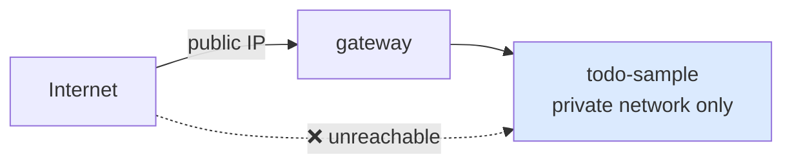

# 06 — 振り返り: やったこと / 残課題

## 対話

> **後輩**「動きました! 認証入りました!」

> **先輩**「**入った気がする**、が正しい。今日やったのは『**配管**』だ。
> 本物の認証 (パスワード, OIDC, MFA…) は通してない。」

## やったこと (記録)

| # | 何 | どこ | 行数 |
|---|---|---|---|
| 1 | TodoServlet を ヘッダ読みに | `todo-sample/src/main/java/todo/TodoServlet.java` | 実質 +2 行 |
| 2 | gateway 設定 | `auth-integration/todo-gateway.yaml` (新規) | 25 行 |
| 3 | mock\_auth 起動 | `volta-gateway` 同梱 example | コード変更なし |

> **先輩**「**アプリ側のコード変更は実質 2 行**。これが proxy パターンの売り。」

## できるようになったこと

- gateway 経由のリクエストはテナント/ユーザ分離される
- client が X-Volta-\* を spoof しても gateway で strip される
- 認証 backend が落ちたら fail-closed (502)
- gateway ログにステップ別レイテンシが残る

## 本番に出す前にやること

> **後輩**「これそのまま本番に出していいですか?」

> **先輩**「ダメ。少なくともこれは必要:」

### 1. mock\_auth → 本物 volta-auth-proxy

```yaml
auth:
  volta_url: http://volta-auth-proxy.internal:8080  # 本物
```

本物起動には:
- PostgreSQL (`DATABASE_URL`)
- `JWT_SECRET`
- IdP 設定 (`IDP_PROVIDER`, `IDP_CLIENT_ID`, `IDP_CLIENT_SECRET`)

詳細: `volta-gateway/docs/getting-started-ja.md` §4

### 2. anonymous fallback を消す (もしくは 401 にする)

`TodoServlet.java` 現状:

```java
if (tenant == null || tenant.isBlank()) tenant = "public";
if (user   == null || user.isBlank())   user   = "anonymous";
```

本番では「proxy 通ってない = 不正アクセス試行」なので **401 で弾く** べき:

```java
if (tenant == null || user == null || tenant.isBlank() || user.isBlank()) {
    error(resp, 401, "unauthorized");
    return;
}
```

### 3. network 分離



todo-sample は **private network からしか到達できない** ようにする。
これが無いとアプリ側の fallback の有無に関わらず spoof 可能。

### 4. TLS

```yaml
server:
  port: 8080
  force_https: true

tls:
  domains: [todo.example.com]
  contact_email: admin@example.com
  port: 443
  staging: false
```

Let's Encrypt 自動取得。

### 5. CORS

ブラウザから叩くなら必須:

```yaml
routing:
  - host: todo.example.com
    backend: http://localhost:27743
    cors_origins:
      - https://todo.example.com
```

### 6. 認可 (role による分岐)

今日扱ったのは **認証 (誰?) と テナント分離** だけ。
「ADMIN だけが delete できる」みたいな認可は `todo-sample/handson/03-rbac/` で別途扱う。

## 比較: 今と本番のギャップ

| 項目 | 今日 | 本番 |
|---|---|---|
| 認証 backend | mock\_auth (固定値) | volta-auth-proxy (OIDC/SAML/...) |
| fallback | anonymous バケット | 401 |
| 入口 | localhost:28888 | https://todo.example.com:443 |
| ネットワーク | 1 ホスト全部 | gateway 公開, backend private |
| TLS | なし | Let's Encrypt 自動 |
| 認可 | テナント分離まで | + role-based |

## 何を学んだか

> **後輩**「今日の収穫を整理すると…」

> **先輩**「**3 つだ:**」

1. **proxy パターンの価値**: アプリのコードは 2 行。認証 library 入れない。
2. **ヘッダ信頼モデル**: gateway が strip + 再生成。network で入口を強制。
3. **fail-closed**: 認証 backend ダウン → 502。誤って通さない。

> **後輩**「逆に **今日やってないこと** は?」

> **先輩**「**本物の認証**。OIDC のリダイレクトとか、Cookie 検証とか、MFA とか。
> あれらは全部 volta-auth-proxy 側の話。アプリ側 (この記録) のスコープ外。」

## プロセスの後片付け

```bash
# 起動した順を逆に
pkill -f "volta-gateway todo-gateway.yaml"
pkill -f "examples/mock_auth"
# todo-sample (Jetty)
pkill -f "jetty:run"
```

## 関連ドキュメント

- 既存の handson 連作: `todo-sample/handson/` (00-overview, 01-volta-headers, ...)
- gateway 詳細: `volta-gateway/README-ja.md` / `volta-gateway/docs/`
- アーキテクチャ全体: `volta-gateway/docs/architecture-ja.md`
- Rust ↔ Java パリティ: `volta-gateway/docs/parity-ja.md`

## おわりに

> **後輩**「次の lesson は?」

> **先輩**「本物の volta-auth-proxy を立てて、ブラウザから OIDC でログインする話。
> それは `volta-auth-proxy/` 側のハンズオンになる。今日のこの記録は **配管完了** までで終わり。」
