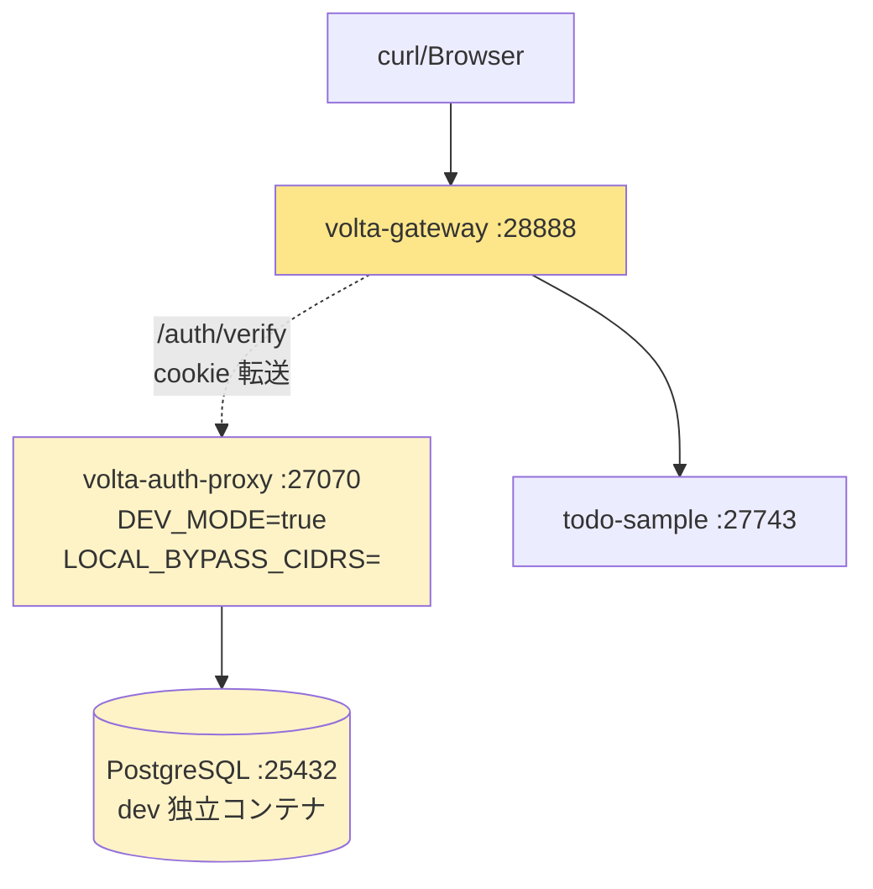

# 10 — Part 2 はじめに: 本物の auth-proxy / 独自ユーザ DB

## 対話

> **後輩**「Part 1 で mock\_auth が `bench-user-001` を返してたとこ、本物の auth-proxy に差し替えたいです。」

> **先輩**「そう、Part 2 はそれをやる。**Google も SAML も使わず**、auth-proxy 単体で
> ユーザを作って認証する。**外部 IdP ゼロ**で完結する。」

> **後輩**「signup フォームってあるんですか?」

> **先輩**「**無い**。これが volta の流儀。」

## ⚠️ volta-auth-proxy には伝統的な「signup フォーム」が無い

> **後輩**「え、ユーザはどうやって作るんです?」

> **先輩**「3 つの方式しかない:」

| 方式 | ユーザ作成タイミング |
|---|---|
| **Magic Link** | `/auth/magic-link/verify` 成功時に `upsertUser(email)` で**自動作成** |
| **Passkey** | `/auth/passkey/start` で admin が事前にユーザ作成 → 本人が Passkey 登録 |
| **Invite** | admin が `/admin/invitations` で招待作成 → 招待リンク踏んで作成 |

> **後輩**「password はどこに保存するんですか?」

> **先輩**「**保存しない**。volta は password 認証を持ってない。
> "password を覚える / リセットする" は人類が解決できなかった問題だから、最初から避ける設計。」

```mermaid
flowchart TD
    A[ユーザを作る方法] --> B[Magic Link<br/>初回ログイン時に upsert]
    A --> C[Passkey<br/>admin が User 作成 → 本人が key 登録]
    A --> D[Invite<br/>admin が招待 → 被招待者が accept]
    A -.→| ❌ NOT SUPPORTED |X[Username/Password]
    style X fill:#fecaca
```

## 3 方式の比較

| 観点 | Magic Link | Passkey | Invite |
|---|---|---|---|
| 必要なもの | email アドレス (架空でOK in dev) | WebAuthn 対応ブラウザ | admin の操作 |
| ユーザ体験 | メールに来たリンクをクリック | 指紋 / 顔認証 | 招待メール → 受諾 |
| 「signup」 | 不要 (1回目=作成) | 不要 (admin が作る) | 招待リンクから |
| Phishing 耐性 | ◯ (link 期限 10分) | ◎ (origin binding) | ◯ (one-time code) |
| 後輩の感想 | 「楽」 | 「未来感」 | 「組織向け」 |
| 何が要る (dev) | 何も要らない (DEV\_MODE で link が response に返る) | HTTPS or `localhost` | admin 操作 |

各方式は Part 2 の章 13/14/15 でそれぞれ実際に走らせる。

## DEV\_MODE という抜け道 (今回フル活用)

> **後輩**「Magic Link って、メール送信サーバ要りませんか?」

> **先輩**「本番は要る (SendGrid とか SMTP)。だが `DEV_MODE=true` だと
> `POST /auth/magic-link/send` の **レスポンスに link がそのまま返る**。」

```bash
$ curl -s -X POST -H 'Content-Type: application/json' \
       -H 'Origin: http://localhost:27070' \
       -d '{"email":"alice@example.com"}' \
       http://localhost:27070/auth/magic-link/send
{
  "ok": true,
  "message": "Login link sent to alice@example.com",
  "token": "KKgSozyUNDBq-TJJ6wk18TXBXuvURRH4_XuK6h3I1RGh5fWfghwedpw6sOZIw7vv",
  "link": "http://localhost:27070/auth/magic-link/verify?token=..."
}
```

`token` と `link` フィールドは **本番では返らない** (`DEV_MODE=false` のとき)。
ハンズオン用の抜け道。これのおかげで SMTP 立てずに済む。

## 全体構成 (Part 2)



## Part 1 との違い

| | Part 1 (mock) | Part 2 (本物) |
|---|---|---|
| 認証 backend | `mock_auth` example | volta-auth-proxy 本体 |
| ユーザ ID | 固定 `bench-user-001` | 実 UUID (Magic Link でログインした人) |
| Tenant | 固定 `tenant-001` | 初回ログイン時に personal tenant 自動作成 |
| Session | なし (常にOK) | 8 時間 TTL の cookie `__volta_session` |
| Cookie 偽装 | できない (mock が無視) | できない (session DB で検証) |
| 「ログアウト」 | 無い概念 | `/auth/logout` で session 失効 |
| 必要なリソース | バイナリ 1 個 | Postgres コンテナ + JWT 鍵 + .env |

## 落とし穴ポイント

> **先輩**「3 つ先に言っとく:」

### 1. `LOCAL_BYPASS_CIDRS` を空にしないと **全リクエストが anonymous で通る**

volta-auth-proxy は LAN/localhost からのリクエストを **デフォで認証スキップ** する。
これは便利機能だが、認証フロー検証には邪魔:

```bash
$ curl -s -D - http://localhost:27070/auth/verify
HTTP/1.1 200 OK
X-Volta-Auth-Source: local-bypass     ← これ
```

`.env` で `LOCAL_BYPASS_CIDRS=` (空) を指定して起動すると、ちゃんと 401 が返るようになる:

```bash
$ curl -s -D - http://localhost:27070/auth/verify
HTTP/1.1 401 Unauthorized
X-Volta-Auth-Reason: cookie_absent_401
```

### 2. CSRF — POST には `Origin` ヘッダか CSRF token が必要

`POST /auth/magic-link/send` を `Origin` 無しで叩くと:

```
{"error":"CSRF_INVALID","message":"CSRF トークンが無効です。"}
```

curl で叩く場合は `-H 'Origin: http://localhost:27070'` を付ければ通る
(同一オリジン扱いで CSRF 不要)。

### 3. JWT 秘密鍵を gitignore し忘れる

`.env` に PEM ベタ書きすると **コミットしてしまうリスク** がある。

`.env` 自体を `.gitignore` に入れる。テンプレ (`.env.template`) だけ commit する。

## 次

→ [11-本物auth-proxy起動.md](11-本物auth-proxy起動.md)
