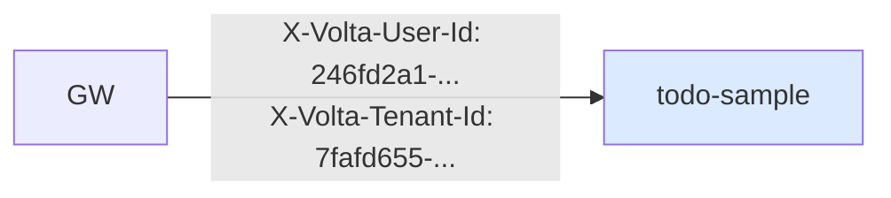

# 12 — gateway / todo-sample を本物 auth-proxy に向ける

## 対話

> **後輩**「auth-proxy 立ったので、Part 1 の gateway を **mock じゃなくて本物**に向けます。」

> **先輩**「設定変えるのは **1 行** だ。`volta_url` を `:7077` に向ける。」

## gateway 設定 (`dev/todo-gateway-dev.yaml`)

```yaml
server:
  port: 8888

auth:
  volta_url: http://localhost:7077       # ← Part 1 の :7072 から :7077 に変更
  verify_path: /auth/verify
  timeout_ms: 1000                       # auth-proxy は JWT 生成するので少し長め
  pool_max_idle: 32

routing:
  - host: localhost
    backend: http://localhost:7743       # todo-sample
    app_id: app-todo

healthcheck:
  interval_secs: 30
  path: /healthz

logging:
  level: info
  format: pretty
```

> **後輩**「`timeout_ms: 500` から `1000` に増やしたんですね」

> **先輩**「mock は即返す。本物は **DB アクセス + JWT 署名** が入るので 500ms はギリギリ。
> 余裕持って 1 秒に。本番でも 1-2 秒は妥当。」

## todo-sample は変更不要

Part 1 で書き換えた `TodoServlet.java` がそのまま動く。
**X-Volta-User-Id / X-Volta-Tenant-Id を読むだけ** の実装は、誰がヘッダ付けても同じ。



mock\_auth のとき: `bench-user-001` / `tenant-001` (固定値)
本物のとき: `246fd2a1-ce53-4bc0-955a-1a1dc7bc693b` (UUID, ログインしたユーザ)

## 起動順

```bash
# 1. Postgres (前章で起動済み)
# 2. auth-proxy (前章で起動済み)

# 3. todo-sample
cd todo-sample
nohup mvn -q jetty:run > /tmp/jetty-dev.log 2>&1 &

# 4. gateway
./volta-gateway/target/release/volta-gateway \
  auth-integration/dev/todo-gateway-dev.yaml > /tmp/gw-dev.log 2>&1 &
```

ポート確認:

```bash
$ ss -tlnp | grep -E ':7077|:7743|:8888|:54330'
:54330  postgres-dev
:7077   auth-proxy (java)
:7743   todo-sample (java, jetty)
:8888   volta-gateway
```

4 つ全部 listen していれば OK。

## まずは認証なしで 302 redirect を確認

```bash
$ curl -s -D - http://localhost:8888/todos | head -5
HTTP/1.1 302 Found
location: /login
x-request-id: f030a4a4-7487-4e7c-a4e6-d566338a30ea
content-length: 0
```

> **後輩**「`location: /login` ってどこから来たんですか?」

> **先輩**「**auth-proxy が返したヘッダ** だ。gateway が `/auth/verify` 叩いて、
> auth-proxy が `cookie_absent_redirect` で 302 を出した。それを gateway がそのまま転送してる。」

gateway ログにも残る:

```json
{"state":"REDIRECT","method":"GET","host":"localhost","path":"/todos",
 "status":302,"user_id":"-","reason":"cookie_absent_redirect"}
```

リクエストは backend (todo-sample) に **届いていない**。auth-proxy のとこで止まってる。これが
fail-closed の意味。

## 詰みポイント

### A. gateway が auth-proxy に繋がらない

```
{"message":"backend unreachable","backend":"http://localhost:7077"}
```

→ auth-proxy が起動してない / port 違う。`curl http://localhost:7077/healthz` で個別確認。

### B. gateway は 302 を出さずに 502 を返す

→ auth-proxy が **5xx** を返してる。auth-proxy のログを見る:

```bash
$ tail /tmp/auth-proxy-dev.log
```

DB 接続エラーが典型。

### C. `local-bypass` で勝手に 200 が返る

→ auth-proxy の `LOCAL_BYPASS_CIDRS` が空じゃない。再起動して環境変数確認。

## 次

→ [13-Magic-Link認証.md](13-Magic-Link認証.md)

次章から **実際にログインして todo を作る** までやる。
