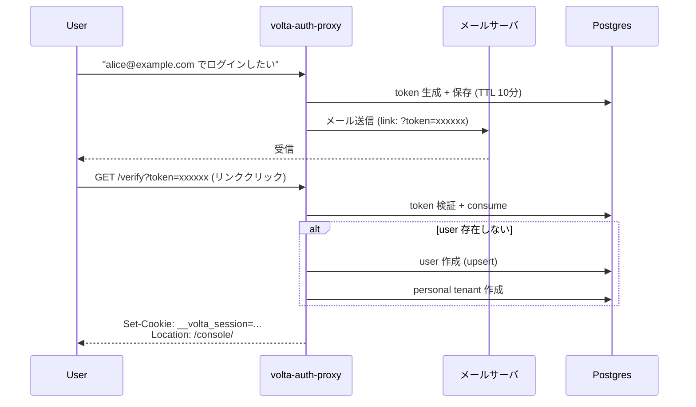

# 13 — Magic Link 認証

## 対話

> **後輩**「Magic Link、メールでログインリンクが届くやつですよね。
> パスワードレス、最近よく見ます。」

> **先輩**「そう。**仕組みはシンプル**だが、考えると深い。順に説明する。」

---

## Magic Link とは

> **後輩**「『パスワードレス』って言うけど、ログインしてるんだから何か必要ですよね。」

> **先輩**「**所持要素 (something you have)** を使う。具体的には『**メールアドレスを使える権限**』だ。」

### 原理



ポイント:
- **token は使い捨て** (`used_at` 列があり、一度 verify したら無効)
- **TTL は 10 分** (`now() + interval '10 minutes'`)
- **初回ログイン = アカウント作成** (`upsertUser`)
- **personal tenant が自動付与** (`createPersonalTenant`)

> **後輩**「メアド入力欄に好きなメアド入れたら、その持ち主のアカウント乗っ取れるんじゃ?」

> **先輩**「**できない**。メール届かないと token 取れない。`alice@example.com` 入れても
> alice 本人がそのメール受け取らないと先に進めない。**メールサーバが本人確認の代わり**。」

---

## なぜパスワードより安全と言われるか

| 攻撃 | password | Magic Link |
|---|---|---|
| パスワードリスト攻撃 | 〇 効く | × そもそも password が無い |
| Phishing (偽サイト) | 〇 効く | △ Phishing site は token 受け取れない (が、本物リンク踏ませる Phishing は依然可能) |
| Brute force | 〇 効く | × Rate limit + TTL でほぼ無理 |
| DB 漏洩 | 〇 hash 解析される | △ token は consume 済みなら無害 |
| 使い回し | 〇 別サービスの被害が波及 | × token はサービス単体 |

> **先輩**「**唯一の弱点**: メールアカウントが乗っ取られたら詰む。だから本気の SaaS は
> Magic Link + MFA (TOTP) を組み合わせる。」

---

## DEV\_MODE での実演

`DEV_MODE=true` だと、auth-proxy はメール送信せずに **レスポンスに link を直接返す**。

### Step 1: link を取得

```bash
$ curl -s -X POST \
       -H 'Content-Type: application/json' \
       -H 'Origin: http://localhost:27070' \
       -d '{"email":"alice@example.com"}' \
       http://localhost:27070/auth/magic-link/send | jq
{
  "ok": true,
  "message": "Login link sent to alice@example.com",
  "token": "KKgSozyUNDBq-TJJ6wk18TXBXuvURRH4_XuK6h3I1RGh5fWfghwedpw6sOZIw7vv",
  "link": "http://localhost:27070/auth/magic-link/verify?token=KKgSozyUNDBq-..."
}
```

> **後輩**「`Origin: http://localhost:27070` 付けてますね、なんで?」

> **先輩**「**CSRF 対策**。POST には `Origin` がないと CSRF\_INVALID で蹴られる。
> 同一オリジンなら exempt されるルールがある (`Main.java` の `isAllowedOrigin`)。」

### Step 2: link を踏む

```bash
$ curl -s -D - -o /dev/null "$LINK"
HTTP/1.1 302 Found
Set-Cookie: __volta_session=a15eebc9-dafc-48b5-8d2a-611253867832; Path=/; Max-Age=28800; HttpOnly; SameSite=Lax
Location: /console/
```

cookie の **`__volta_session`** を抽出する:

```bash
COOKIE=$(curl -s -D - -o /dev/null "$LINK" | \
  awk -F': ' 'BEGIN{IGNORECASE=1} /^set-cookie:/ {print $2}' | \
  head -1 | cut -d';' -f1 | tr -d '\r')
echo "$COOKIE"
# => __volta_session=a15eebc9-dafc-48b5-8d2a-611253867832
```

### Step 3: gateway 経由で todo-sample を叩く

```bash
$ curl -s -H "Cookie: $COOKIE" http://localhost:28888/todos
[]

$ curl -s -H "Cookie: $COOKIE" -X POST \
       -H 'Content-Type: application/json' \
       -d '{"title":"alice の本物 todo"}' \
       http://localhost:28888/todos
{"id":1,"title":"alice の本物 todo","done":false,"createdAt":1779666178500}

$ curl -s -H "Cookie: $COOKIE" http://localhost:28888/todos
[{"id":1,"title":"alice の本物 todo","done":false,"createdAt":1779666178500}]
```

**成功**。実際の認証経由で todo を作成・取得できた。

---

## auth-proxy が gateway に返した X-Volta-\* (実ログ)

`gateway → auth-proxy /auth/verify` のレスポンスヘッダを直接見ると:

```bash
$ curl -s -D - -H "Cookie: $COOKIE" http://localhost:27070/auth/verify | head -15
HTTP/1.1 200 OK
X-Volta-User-Id: 246fd2a1-ce53-4bc0-955a-1a1dc7bc693b
X-Volta-Email: alice@example.com
X-Volta-Tenant-Id: 7fafd655-5f66-4b4e-b401-0face9b824a0
X-Volta-Tenant-Slug: alice-246fd2
X-Volta-Roles: OWNER
X-Volta-JWT: eyJraWQiOiJrZXktMjAyNi0wNS0yNFQyMy0zNy0wMFoiLCJ0eXAiOiJKV1Qi...
```

ポイント:
- `X-Volta-User-Id` = UUID。**初回ログインで作られた**
- `X-Volta-Tenant-Id` = UUID。**personal tenant が自動作成された**
- `X-Volta-Tenant-Slug` = `alice-246fd2`。tenant の人間可読 ID
- `X-Volta-Roles: OWNER`。personal tenant では本人が所有者
- `X-Volta-JWT` = この session の JWT (検証可能)

これが gateway を経由して todo-sample に渡る。
todo-sample は X-Volta-Tenant-Id + X-Volta-User-Id をキーに bucket 分離。

---

## マルチユーザでテナント分離を確認

```bash
# alice の cookie
ALICE=$(curl -s -D - -o /dev/null "http://localhost:27070/auth/magic-link/verify?token=$(curl -s -X POST -H 'Content-Type: application/json' -H 'Origin: http://localhost:27070' -d '{"email":"alice@example.com"}' http://localhost:27070/auth/magic-link/send | python3 -c 'import sys,json;print(json.load(sys.stdin)["token"])')" | awk -F': ' 'BEGIN{IGNORECASE=1} /^set-cookie:/ {print $2}' | head -1 | cut -d';' -f1 | tr -d '\r')

# bob の cookie
BOB=$(curl -s -D - -o /dev/null "http://localhost:27070/auth/magic-link/verify?token=$(curl -s -X POST -H 'Content-Type: application/json' -H 'Origin: http://localhost:27070' -d '{"email":"bob@example.com"}' http://localhost:27070/auth/magic-link/send | python3 -c 'import sys,json;print(json.load(sys.stdin)["token"])')" | awk -F': ' 'BEGIN{IGNORECASE=1} /^set-cookie:/ {print $2}' | head -1 | cut -d';' -f1 | tr -d '\r')

# それぞれ todo 作る
curl -s -H "Cookie: $ALICE" -X POST -H 'Content-Type: application/json' \
     -d '{"title":"alice secret"}' http://localhost:28888/todos
# {"id":1,"title":"alice secret",...}

curl -s -H "Cookie: $BOB" -X POST -H 'Content-Type: application/json' \
     -d '{"title":"bob secret"}' http://localhost:28888/todos
# {"id":1,"title":"bob secret",...}    ← id=1 だが別 bucket
```

確認: alice からは alice の todo しか見えない:

```bash
$ curl -s -H "Cookie: $ALICE" http://localhost:28888/todos
[{"id":1,"title":"alice secret",...}]

$ curl -s -H "Cookie: $BOB" http://localhost:28888/todos
[{"id":1,"title":"bob secret",...}]
```

> **後輩**「`id=1` が両方に出てるけど、内容が違いますね。」

> **先輩**「**`TodoStore` は `(tenant, user) -> Map<Long, Todo>` の構造**。
> alice の bucket と bob の bucket が独立。だから id=1 が両方にあっても矛盾しない。」

---

## まとめ

| 項目 | 値 |
|---|---|
| 使うエンドポイント | `POST /auth/magic-link/send` + `GET /auth/magic-link/verify?token=...` |
| 必要なヘッダ | `Origin` (CSRF exempt のため) |
| Token TTL | 10 分 |
| Session TTL | 8 時間 (28800 秒) |
| ユーザ自動作成 | あり (`upsertUser`) |
| Personal tenant 自動作成 | あり (`createPersonalTenant`) |
| 本番との違い | `DEV_MODE=true` でレスポンスに link が返る。本番は SMTP / SES 経由 |

> **後輩**「これだけ動けば十分使える気がするんですが。なぜ Passkey とか Invite も要るんです?」

> **先輩**「Magic Link の弱点は **メール依存**。受信箱があれば誰でも入れる。
> Phishing リンク踏みやすい人もいる。**Passkey は origin binding** で本物サイト以外じゃ動かない。
> **Invite は招待制 SaaS** に必要。組み合わせるもの。」

## 次

→ [14-Passkey認証.md](14-Passkey認証.md)
