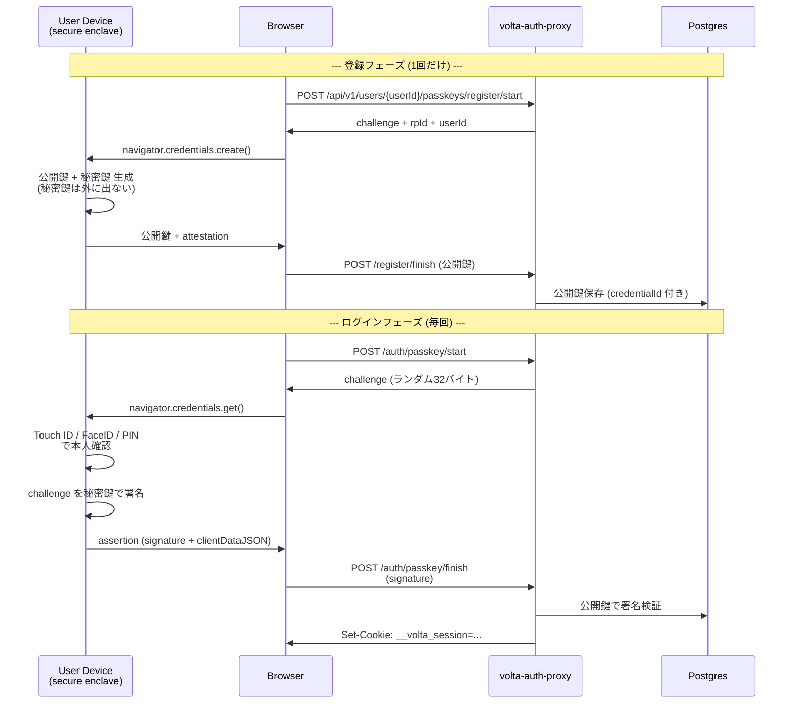

# 14 — Passkey 認証 (WebAuthn)

## 対話

> **後輩**「Passkey って iPhone でやってるあれですよね、Touch ID で『はい』するやつ。
> サイトに登録できるんですね。」

> **先輩**「そう。中身は **WebAuthn** という W3C 標準。仕組み知ると面白いから、まず原理を。」

---

## Passkey の正体: WebAuthn

> **後輩**「あれ、パスワード『記憶』しないんですよね? どうやって認証するんですか?」

> **先輩**「**公開鍵暗号**。サイト側にあるのは公開鍵だけ。秘密鍵はユーザの端末 (Secure Enclave / TPM) にある。」

### 流れ



### なぜ強いか

| 攻撃 | Password | Passkey |
|---|---|---|
| Phishing (偽サイト) | 〇 効く | × **origin binding** で本物以外で動作しない |
| Server DB 漏洩 | 〇 hash 解析 | × 漏れるのは公開鍵だけ (使えない) |
| Replay attack | △ HTTPS なら防げる | × challenge が毎回ランダム |
| キーロガー | 〇 効く | × そもそも入力するものが無い |
| 端末紛失 | (関係ない) | △ 別端末で revoke 可能 |

> **後輩**「**Phishing が原理的に効かない** ってすごいですね。」

> **先輩**「これが Passkey が広まる理由。Google / Apple / Microsoft が
> **password 廃止のロードマップ** にしてるのもこのため。」

---

## Origin Binding の仕組み

> **後輩**「`origin binding` って何ですか?」

> **先輩**「**`clientDataJSON` に origin が刻まれて署名される**。だから:」

```json
// 本物サイト (origin: https://todo.example.com) で署名された clientDataJSON
{
  "type": "webauthn.get",
  "challenge": "abc123...",
  "origin": "https://todo.example.com"   // ← これ
}
```

```
攻撃者の偽サイト (https://t0do.example.com) で同じ challenge を渡しても、
ブラウザは origin: "https://t0do.example.com" を埋め込む。
本物サーバは「期待 origin と違う」で検証失敗。
```

**ユーザが何も気付かなくても、ブラウザが防いでくれる**。これが原理的な強さ。

---

## ⚠️ Passkey は curl では試せない

> **後輩**「curl で 3 ステップ試そうとしてた…」

> **先輩**「**ブラウザ必須**。`navigator.credentials.create()` は Web 標準 API で、
> Secure Enclave / TPM / Windows Hello を叩く。**サーバから叩けない**。」

ハンズオン用には:

1. **ブラウザで volta-auth-proxy の `/login` を開く**
2. `🔑 パスキーでログイン` ボタンを押す
3. (初回) Magic Link で先に user 作って Passkey を登録 → 以降 Passkey でログイン

---

## 実際にやる手順

### 1. ブラウザで auth-proxy を開く

```
http://localhost:27070/login
```

WebAuthn は **`localhost` は HTTP でも例外的に動く** (HTTPS じゃなくても OK)。
本番ドメインだと HTTPS 必須。

### 2. Passkey 登録 (初回のみ)

> **後輩**「Passkey 登録の UI ってどこにあるんです?」

> **先輩**「`/console/` (admin SPA)。先に Magic Link でログインしてから:」

```bash
# Magic Link でログイン (前章と同じ)
TOKEN=$(curl -s -X POST -H 'Content-Type: application/json' -H 'Origin: http://localhost:27070' \
        -d '{"email":"alice@example.com"}' \
        http://localhost:27070/auth/magic-link/send | jq -r .token)
# ブラウザでこの URL を開く:
echo "http://localhost:27070/auth/magic-link/verify?token=$TOKEN"
```

ログイン後、`/console/` に飛ばされる。
Passkey 登録 UI に進み (まだ実装が console 側に出てない場合は API 直接叩く):

```bash
# /api/v1/users/{userId}/passkeys/register/start
# (session cookie 付きで)
```

### 3. Passkey ログイン

ブラウザで `/login` → `🔑 パスキーでログイン` → Touch ID / Windows Hello → 完了。

---

## サーバ側の保存内容 (`passkey_credentials` 表)

| カラム | 内容 | 例 |
|---|---|---|
| `credential_id` | Passkey の ID (base64url) | `f0bX9Yz...` |
| `user_id` | 紐付くユーザ UUID | `246fd2a1-...` |
| `public_key` | 公開鍵 (COSE 形式) | binary |
| `sign_count` | 署名カウンタ (リプレイ防止) | `42` |
| `aaguid` | authenticator 種別 | `00000000-...` (platform) |
| `created_at` | 登録日時 | `2026-05-25...` |

> **先輩**「**`sign_count`** が秘伝のタレ。Passkey が署名するたび増える。
> サーバが前回より小さい数値を受け取ったら『**秘密鍵が複製された可能性**』として警告できる。」

---

## RP ID (Relying Party ID)

> **後輩**「`rpId` って何ですか?」

> **先輩**「**Passkey が紐付くドメイン**。`example.com` で登録した Passkey は
> `*.example.com` のどこでも使える。**他のドメインでは絶対に使えない**。」

| 状況 | rpId |
|---|---|
| `todo.example.com` でログイン | `example.com` (登録時 rpId=`example.com` にしておけば) |
| `auth.example.com` でログイン | 同上、共有可能 |
| `localhost:27070` | `localhost` |
| `evilsite.com` 攻撃者 | **取得不可** (origin が違う) |

これが phishing を原理的に防ぐ仕組みの正体。

---

## まとめ

| 項目 | 値 |
|---|---|
| ログインエンドポイント | `POST /auth/passkey/start` + `POST /auth/passkey/finish` |
| 登録エンドポイント | `POST /api/v1/users/{userId}/passkeys/register/start` + `/finish` |
| 必要なもの | WebAuthn 対応ブラウザ (大体すべて) + Touch ID / Windows Hello / セキュリティキー |
| サーバ保存 | 公開鍵のみ (秘密鍵は端末から出ない) |
| Phishing 耐性 | ◎ origin binding |
| 弱点 | 端末紛失 (= 別端末から revoke で対応) |
| 本番との違い | localhost は HTTP OK、本番は HTTPS 必須 |

> **後輩**「最強じゃないですか?」

> **先輩**「**ほぼ最強**。ただし **登録の最初**にユーザ確認が要る (= Magic Link や Invite の出番)。
> Passkey 単体では『誰の Passkey か』が決まらないので。組み合わせるもの。」

## 次

→ [15-Invite認証.md](15-Invite認証.md)
