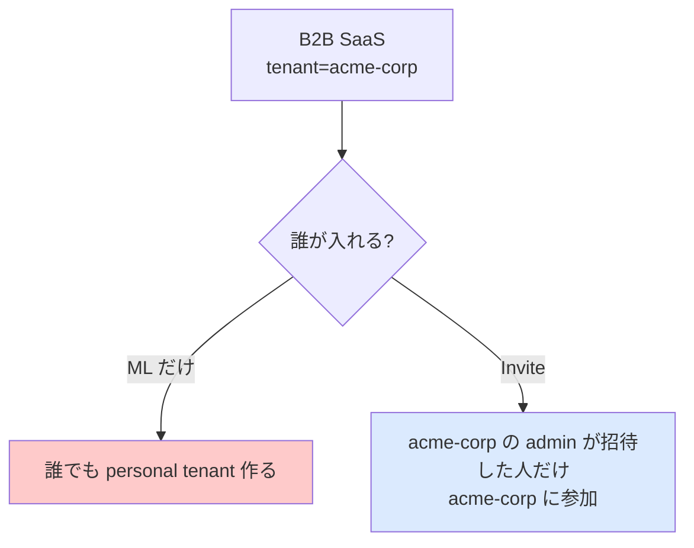
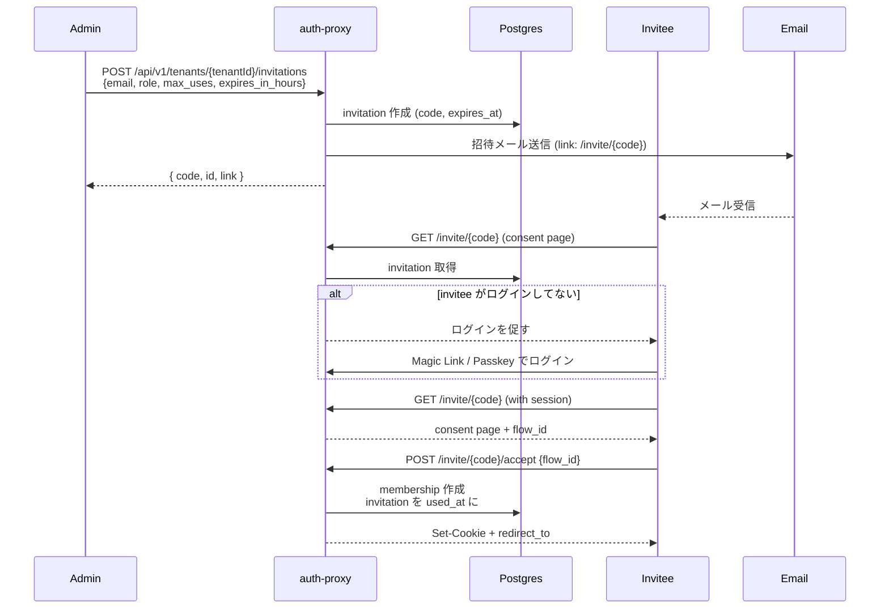

# 15 — Invite (招待) 認証

## 対話

> **後輩**「招待制 SaaS でよく見るやつですね。Slack とか Notion とか。」

> **先輩**「そう。Magic Link が **誰でも入れる** のに対し、Invite は **既存メンバーが認めた人だけ入れる**。
> B2B でテナント単位に閉じてる SaaS では必須機能。」

---

## Invite が解決する課題



- **Magic Link 単体**: 各人が独立した personal tenant を持つ → コラボできない
- **Invite**: admin が招待した相手が **既存テナントのメンバー**になる → コラボできる

---

## 仕組み



---

## 実演 (実ログ込み)

### Step 1: admin としてログイン

```bash
EMAIL="admin-$(date +%s)@example.com"   # ユニークな email を毎回生成
TOK=$(curl -s -X POST -H 'Content-Type: application/json' -H 'Origin: http://localhost:7077' \
      -d "{\"email\":\"$EMAIL\"}" \
      http://localhost:7077/auth/magic-link/send | jq -r .token)

H=$(curl -s -D - -o /dev/null "http://localhost:7077/auth/magic-link/verify?token=$TOK")
COOKIE=$(echo "$H" | awk -F': ' 'BEGIN{IGNORECASE=1} /^set-cookie:/ {print $2}' | head -1 | cut -d';' -f1 | tr -d '\r')

# admin の tenant_id を auth/verify ヘッダから取得
TENANT=$(curl -s -D - -H "Cookie: $COOKIE" -o /dev/null http://localhost:7077/auth/verify | \
         awk -F': ' 'BEGIN{IGNORECASE=1} /^x-volta-tenant-id:/ {print $2}' | tr -d '\r')
echo "admin: $EMAIL"
echo "tenant: $TENANT"
# admin: admin-1779666748@example.com
# tenant: e90472f0-b917-4bf9-aa7e-6af45dee2b8a
```

> **後輩**「`X-Volta-Roles: OWNER` でしたよね、personal tenant では。」

> **先輩**「そう。OWNER は ADMIN 以上なので `enforceMinRole(ADMIN)` を満たす。
> 招待を作る権限がある。」

### Step 2: invitation を作る (admin の操作)

```bash
$ curl -s -H "Cookie: $COOKIE" -X POST \
       -H 'Content-Type: application/json' -H "Origin: http://localhost:7077" \
       -d '{"email":"invitee-1779666748@example.com","role":"MEMBER","max_uses":1,"expires_in_hours":24}' \
       "http://localhost:7077/api/v1/tenants/$TENANT/invitations"
{
  "code": "EXX09dhOfCY843nxnSC41YCLNqwrPsGn",
  "id": "073a465d-7070-4932-a086-3f813d995b7d",
  "link": "http://localhost:7077/invite/EXX09dhOfCY843nxnSC41YCLNqwrPsGn",
  "expiresAt": "2026-05-25T23:52:29.031094212Z"
}
```

実ログ:
- **`code`** — invitee が踏むリンクの末尾
- **`id`** — invitation の UUID (admin が後で削除/管理する用)
- **`link`** — 完全 URL。普通はこれがメールで届く
- **`expiresAt`** — TTL。デフォ 72 時間、ここでは 24 時間に指定

### Step 3: invitee がリンクを開く (未ログイン)

```bash
$ curl -s "http://localhost:7077/invite/$CODE" | head -20
<!doctype html>
...
<h1>ワークスペース招待</h1>
<p>... さんが admin-1779666748 workspace に招待しています。</p>
<p>参加ロール: MEMBER</p>
<a href="/login">ログイン</a>
```

未ログインだとログインを促される。

### Step 4: invitee が Magic Link でログイン → invite ページに戻る

```bash
INV_TOK=$(curl -s -X POST -H 'Content-Type: application/json' -H 'Origin: http://localhost:7077' \
          -d '{"email":"invitee-1779666748@example.com"}' \
          http://localhost:7077/auth/magic-link/send | jq -r .token)
INV_COOKIE=$(curl -s -D - -o /dev/null "http://localhost:7077/auth/magic-link/verify?token=$INV_TOK" | \
             awk -F': ' 'BEGIN{IGNORECASE=1} /^set-cookie:/ {print $2}' | head -1 | cut -d';' -f1 | tr -d '\r')

$ curl -s -H "Cookie: $INV_COOKIE" "http://localhost:7077/invite/$CODE" | head -30
<!doctype html>
...
<h1>ワークスペース招待</h1>
<p>... さんが admin-1779666748 workspace に招待しています。</p>
<form action="/invite/EXX09.../accept" method="POST">
  <input type="hidden" name="flow_id" value="..."/>
  <input type="hidden" name="_csrf" value="..."/>
  <button>参加する</button>
</form>
```

> **後輩**「`flow_id` って?」

> **先輩**「**tramli の flow instance ID**。consent ページを表示した時点で auth-proxy が
> InviteFlow を開始してる。accept のとき同じ flow_id を渡すことで継続できる。
> 状態マシンで管理してるから、不正な遷移は構造的に起きない。」

### Step 5: accept を POST

```bash
# form の hidden 値を抽出 (実際は jsoup や grep で)
$ curl -s -H "Cookie: $INV_COOKIE" -X POST \
       -H 'Content-Type: application/json' -H 'Origin: http://localhost:7077' \
       -d "{\"flow_id\":\"<上で取った flow_id>\"}" \
       "http://localhost:7077/invite/$CODE/accept"
{
  "ok": true,
  "redirect_to": "/console/"
}
```

これで invitee は admin の tenant のメンバーになった。

### Step 6: invitee の auth/verify で tenant 切り替わったか確認

```bash
$ curl -s -D - -H "Cookie: $INV_COOKIE" -o /dev/null \
       http://localhost:7077/auth/verify | grep -i 'x-volta-tenant'
X-Volta-Tenant-Id: e90472f0-b917-4bf9-aa7e-6af45dee2b8a   # admin と同じ tenant!
X-Volta-Tenant-Slug: admin-1779666748-...
```

invitee の current tenant が **personal tenant から admin の tenant に切り替わった**。
今後 invitee が todo-sample にアクセスすると、admin のテナントの bucket で操作することになる。

---

## consent ページ vs JSON API

> **後輩**「consent ページ HTML 返してくるんですね、UI 想定?」

> **先輩**「そう、デフォは HTML。`Accept: application/json` 付ければ JSON も返る:」

```bash
$ curl -s -H "Cookie: $INV_COOKIE" -H 'Accept: application/json' \
       "http://localhost:7077/invite/$CODE"
{
  "tenantName": "admin-1779666748 workspace",
  "tenantId": "e90472f0-b917-...",
  "role": "MEMBER",
  "flowId": "...",
  "expiresAt": "..."
}
```

これでカスタム UI から API として叩ける。SPA 向き。

---

## invitation の管理

admin は自分の招待を一覧 / 取消できる:

```bash
# 一覧
$ curl -s -H "Cookie: $COOKIE" \
       "http://localhost:7077/api/v1/tenants/$TENANT/invitations" | jq
[
  {
    "id": "073a465d-...",
    "code": "EXX09dh...",
    "email": "invitee-...",
    "role": "MEMBER",
    "max_uses": 1,
    "used_count": 1,         ← invitee が accept したので消費済み
    "expires_at": "...",
    "created_by": "..."
  }
]

# 取消 (まだ未使用なら無効化)
$ curl -X DELETE -H "Cookie: $COOKIE" \
       "http://localhost:7077/api/v1/tenants/$TENANT/invitations/$INVID"
```

---

## ⚠️ ハマったこと: upsertUser bug

実演中に発覚したバグ:

```
ERROR: duplicate key value violates unique constraint "users_email_key"
詳細: Key (email)=(alice@example.com) already exists.
```

`magic-link/verify` 内の `upsertUser` が、**2 回目のログインで例外を出す**
(insert で primary key 衝突)。

回避策: 同じ email で 2 回 magic link verify しない。**ユニークな email を毎回使う**
(`alice-$(date +%s)@example.com` のように)。

これは volta-auth-proxy 側の bug。issue 起票案件。

---

## 招待関連の権限ルール

| 操作 | 必要な role |
|---|---|
| POST invitations 作成 | ADMIN 以上 (= ADMIN or OWNER) |
| GET invitations 一覧 | ADMIN 以上 |
| DELETE invitation 取消 | ADMIN 以上 |
| GET /invite/{code} consent | 誰でも (code 知ってれば) |
| POST /invite/{code}/accept | 招待 email に一致するユーザのみ |

email の不一致をチェックしてくれるので、**他人の招待を横取りできない**。

---

## まとめ

| 項目 | 値 |
|---|---|
| invitation 作成 | `POST /api/v1/tenants/{tenantId}/invitations` (admin) |
| consent | `GET /invite/{code}` |
| accept | `POST /invite/{code}/accept` {flow_id} |
| ユーザ作成 | invitee が ML / Passkey でログイン済みである必要がある |
| Tenant 参加 | accept すると admin の tenant に MEMBER として追加される |
| TTL | デフォ 72 時間、`expires_in_hours` で指定可能 |
| 多重使用 | `max_uses` で制御 (デフォ 1) |

> **後輩**「Magic Link + Invite を組み合わせれば、ユーザ作成と組織参加が両方できますね。」

> **先輩**「**そう、それが volta の想定する典型運用**。Passkey は二回目以降の楽さを上げる、
> という位置付け。」

## 次

→ [16-Part2振り返り.md](16-Part2振り返り.md)
