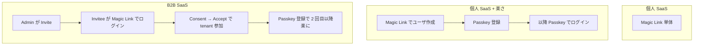
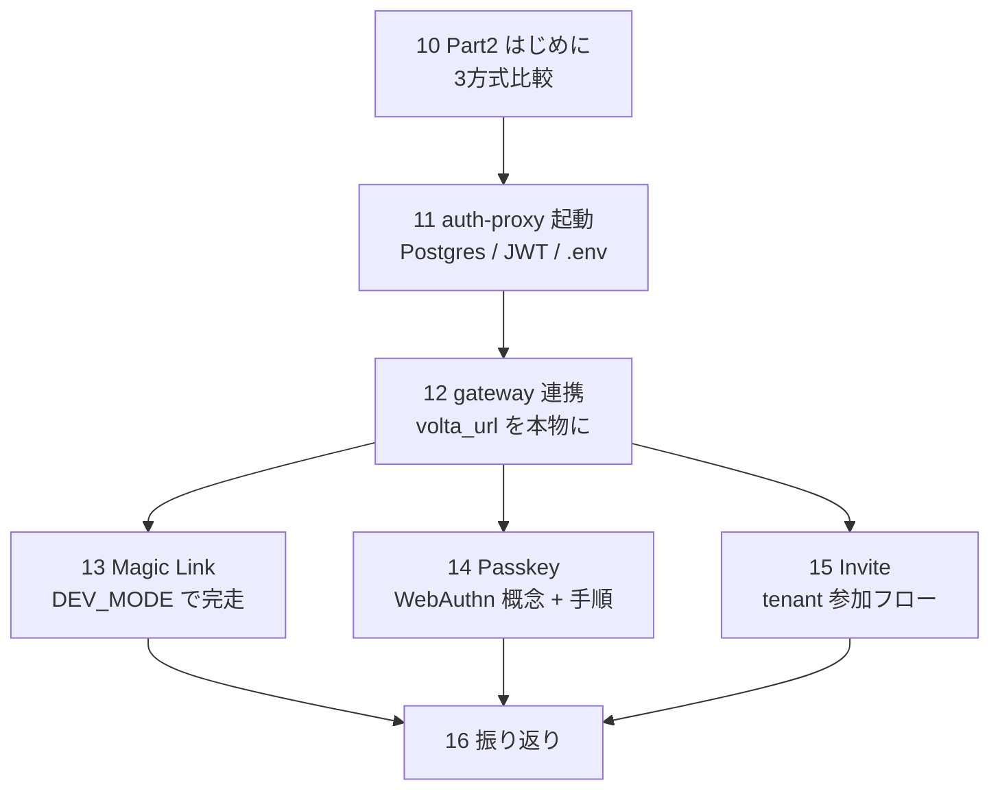
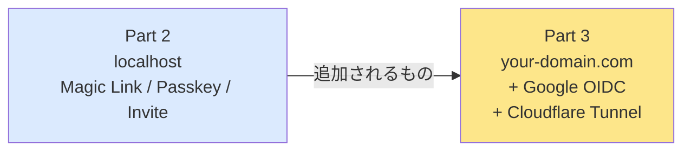

# 16 — Part 2 振り返り: 3 方式比較 / Part 3 への橋渡し

## 対話

> **後輩**「3 方式やってみました。それぞれ目的が違うんですね。」

> **先輩**「**組み合わせて使うもの**。単独だと弱点を補えない。」

## 3 方式比較

### 機能比較

| 観点 | Magic Link | Passkey | Invite |
|---|---|---|---|
| **目的** | パスワードレスなログイン | 強固な再ログイン | テナント参加 |
| **初回 / 継続** | 両方 | 継続のみ (初回登録時に他方式要) | 初回参加 |
| **必要なもの (本番)** | SMTP | WebAuthn ブラウザ | admin の操作 |
| **必要なもの (dev)** | DEV\_MODE | localhost (HTTPS不要) | admin session |
| **ユーザ自動作成** | ◯ | ✕ (事前に必要) | ✕ (accept 時点) |
| **Tenant 自動作成** | ◯ (personal) | ✕ | ✕ (招待元 tenant に参加) |
| **Phishing 耐性** | △ | ◎ origin binding | △ |
| **DB 漏洩耐性** | △ token は consume 済みなら無害 | ◎ 公開鍵だけ | ◯ code consume |
| **使い勝手** | メール待ち発生 | 一瞬 | メール → クリック → consent |
| **対応端末** | 何でも | WebAuthn 端末 | 何でも |
| **本記録での検証** | ✅ 完走 | ⚠️ ブラウザ必要 (curl 不可) | ✅ API レベル完走 |

### 用途比較



> **後輩**「組み合わせって、こういう順番なんですね。」

> **先輩**「**Magic Link がベース** だ。Passkey も Invite も『ログイン手段』を別途要するので、
> 一番取っ付きやすいのが Magic Link。本番では SMTP 立てればすぐ動く。」

## どの方式をいつ使う?

| アプリの性質 | 推奨 |
|---|---|
| 一人で使う todo / メモ系 | Magic Link 単体で十分 |
| 個人 SaaS で本人が頻繁ログイン | Magic Link + Passkey |
| B2B SaaS (組織 / チーム) | Invite + Magic Link |
| 高セキュリティ B2B | Invite + Passkey 必須 + MFA |
| 巨大 SaaS で公開誰でも | OIDC (Google など、Part 3) |

## やったこと (Part 2 全体)



時間で言うと:
- dev 環境構築: 20 分
- 各方式の検証: 各 15-30 分
- ドキュメント読み: 15-20 分

合計 **1 時間** 程度。

## Part 1 → Part 2 で何が変わったか

| | Part 1 (mock) | Part 2 (本物) |
|---|---|---|
| 認証 backend | mock\_auth example | volta-auth-proxy 本体 (DB付き) |
| User | `bench-user-001` 固定 | UUID (実ログイン人) |
| Tenant | `tenant-001` 固定 | personal tenant 自動作成 or 招待で参加 |
| Session | 無し | 8h TTL cookie |
| 偽装 | gateway が strip | gateway が strip + auth-proxy DB 検証 |
| ログアウト | 概念無し | `/auth/logout` で session 失効 |
| Local bypass | 関係なし | `LOCAL_BYPASS_CIDRS=` で無効化必要 |
| CSRF | 関係なし | POST に `Origin` ヘッダか CSRF token |

## 見つかった issue / 課題

1. **upsertUser bug** — 既存 email で magic-link verify が 500 を返す
   - 回避: ユニーク email を毎回使う
   - 修正案: SqlStore.java の INSERT 文に `ON CONFLICT DO UPDATE` を入れる

2. **CSRF\_INVALID at /auth/magic-link/send** — Origin ヘッダ無いと拒否される
   - ドキュメントには明記されていない
   - curl で叩くとき `-H 'Origin: http://localhost:7077'` 必須

3. **local-bypass がデフォで有効** — `127.0.0.1` を含む CIDR が
   全部通る設計なので、認証フローの検証時はオフにする

## Part 3 への橋渡し

> **後輩**「Part 3 では何が変わるんですか?」

> **先輩**「**外部 IdP (Google)** と **自分のドメイン** が入る。」



追加で必要になるもの:
- **ドメイン** (Cloudflare Registrar で年 \$10)
- **Cloudflare アカウント** (無料)
- **cloudflared** (Cloudflare Tunnel クライアント)
- **GCP の OAuth クライアント** (無料)
- **本物の HTTPS** (Cloudflare が自動取得)

なくなるもの:
- `DEV_MODE` の link 直返し (本番は SMTP / SES 必要)
- `LOCAL_BYPASS_CIDRS` の空指定 (本番は明示的に絞る)

## あとは: 後片付け

dev インスタンスを止めるとき:

```bash
# プロセス殺す
pkill -f "volta-auth-proxy.*jar"
pkill -f "target/release/volta-gateway"
pkill -f "jetty:run"

# dev Postgres コンテナ停止
docker stop volta-auth-postgres-dev
# 完全消去なら:
docker rm volta-auth-postgres-dev
```

dev/ フォルダの中身 (JWT 鍵など) は **個人のローカルに残す**。`.gitignore` に入れて
**push 対象外**にする。

## 次

→ [20-Part3はじめに.md](20-Part3はじめに.md)
