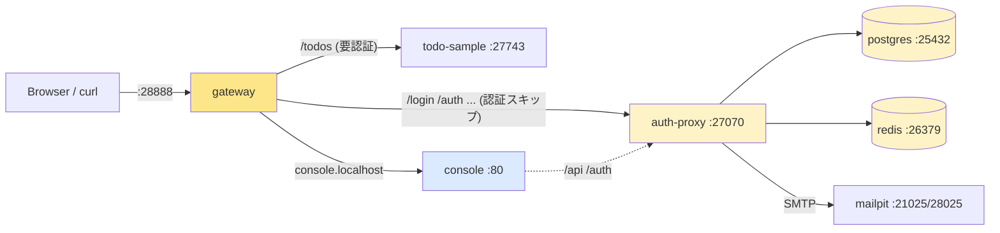
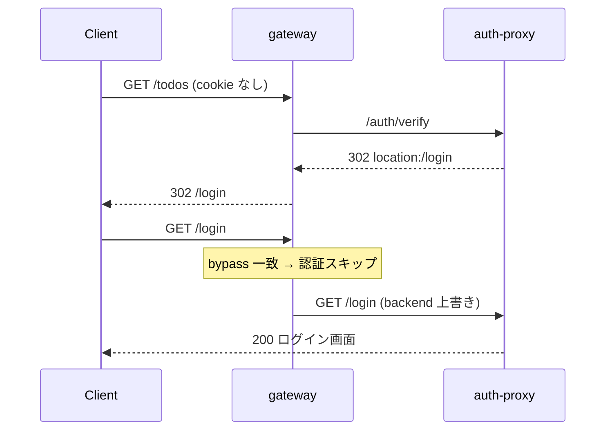

# 17 — Part 2 を docker-compose で一発起動

> Part 2 (章 10〜16) では postgres / auth-proxy / todo-sample / gateway を
> **手で 4 プロセス**立てた。ここではそれを **docker compose 一発**にまとめる。
> admin console と mailpit も足して、認証フローを画面でも追えるようにする。

## 対話

> **後輩**「Part 2、毎回 Postgres 立てて JWT 鍵 source して jar 起動して gateway 起動して…って手順多すぎませんか。閉じるたびに全部やり直しで。」

> **先輩**「だな。**配管の理解が済んだら、あとは固める**。`docker compose up` 一発で 4 プロセス + おまけ 2 つが立つようにする。」

> **後輩**「Part 1 で『配管を体で理解しろ』って言ってたのに、もう隠すんですか?」

> **先輩**「**理解した後に隠すのはいい**。理解せずに隠すのがダメなだけ。お前はもう手で立てた。なら compose 化していい。」

---

## 何を立てるか



| service | 役割 | 公開ポート | ビルド |
|---|---|---|---|
| `postgres` | dev DB | 25432→25432 | image |
| `redis` | auth イベント / telemetry の publish 先 | (内部 26379) | image |
| `mailpit` | SMTP catcher + メール閲覧 UI | 28025 | image |
| `auth-proxy` | 本物の認証 backend (Java) | (内部 27070) | ソースから**完全自己完結ビルド** (多段) |
| `todo-sample` | 対象アプリ (Java/Jetty) | (内部 27743) | maven jetty:run |
| `console` | admin SPA (静的) | (内部 80) | nginx + dist |
| `gateway` | **唯一の入口** (Rust) | 28888 | cargo build (完全自己完結) |

> **後輩**「外に開いてるの `28888` と、おまけの `25432` / `28025` だけですね。」

> **先輩**「そう。**入口は gateway だけ**ってのが Part 2 で叩き込んだヘッダ信頼モデル
> (`01-アーキテクチャ決定.md`) の実装。auth-proxy も todo も docker network の中に隠れてて、
> 外から直接は叩けない。」

---

## ファイル構成

build context は **兄弟ディレクトリ** (`../volta-gateway` など)。未 clone なら
`./setup.sh` で 4 repo を兄弟に揃えてから (README「準備」参照)。

```
auth-integration/
├── docker-compose.yml          ← 本体
├── setup.sh                     ← 兄弟 repo を clone (冪等)
├── dev/
│   ├── gen-dev-env.sh           ← JWT 鍵 + auth-proxy-dev.env を生成 (冪等)
│   └── auth-proxy-dev.env       ← 秘密 (JWT 鍵 / secret)。gen-dev-env.sh が生成。gitignore 対象
└── docker/
    ├── todo-gateway-docker.yaml ← gateway 設定 (service 名 backend)
    ├── volta-config-docker.yaml ← auth-proxy の apps 定義 (mount)
    ├── auth-proxy.docker.env    ← docker 向け上書き (非秘密。commit 可)
    └── console.nginx.conf       ← console 配信 + /api を auth-proxy へ中継
```

---

## キモ 1: gateway が「同一 host で複数 backend」を捌く方法

> **後輩**「ローカルだと auth-proxy は別ポート (:27070) で直接叩いてました。
> でも docker だと auth-proxy は隠れてる。`/login` 画面ってどこから出るんですか?」

> **先輩**「**全部 gateway 経由**にする。`/login` も `/todos` も同じ `localhost:28888`。
> ただし振り分け先が違う。」

ここで問題。volta-gateway は **同一 host での path_prefix ルーティングを未サポート**:

```
# gateway/src/config.rs:403
duplicate routing host: ... — path_prefix based routing on same host is not yet supported.
```

> **後輩**「じゃあ `/login`→auth-proxy、`/todos`→todo って分けられないじゃないですか。」

> **先輩**「`auth_bypass_paths` の **backend 上書き**を使う。bypass エントリは
> prefix ごとに backend を持てる (`gateway/src/proxy.rs:624`)。」

```yaml
routing:
  - host: localhost
    backend: http://todo-sample:27743        # 既定 = 要認証
    auth_bypass_paths:
      - { prefix: /login, backend: http://auth-proxy:27070 }  # 認証スキップ + 別 backend
      - { prefix: /auth,  backend: http://auth-proxy:27070 }
      # ... /callback /css /js /.well-known /api /mfa /oauth /select-tenant
```

これで 1 ルートのまま:

- `/todos` → 認証チェック → `todo-sample`
- `/login` 等 → 認証スキップ → `auth-proxy` (ログイン画面はここが描画)



> **後輩**「`/login` を bypass にしないと?」

> **先輩**「`/login` 自身も認証チェックされて、また 302 `/login` …で**無限ループ**だ。
> 認証ページは必ず bypass。」

---

## キモ 2: 秘密は dev/ から流用、docker 向けの値だけ上書き

> **後輩**「JWT 秘密鍵を compose に直書きは嫌ですね。」

> **先輩**「書かない。11 章で作った `dev/auth-proxy-dev.env` を **env_file でそのまま読む**。
> その後に docker 用の `auth-proxy.docker.env` を重ねて、network 向けの値だけ上書きする。」

```yaml
  auth-proxy:
    env_file:
      - ./dev/auth-proxy-dev.env        # 秘密 (PEM / secret)。後勝ちで…
      - ./docker/auth-proxy.docker.env  # ←これが上書き (非秘密)
```

`auth-proxy.docker.env` で書き換える値:

| 変数 | ローカル | docker | 理由 |
|---|---|---|---|
| `PORT` | 27070 | 27070 | コンテナ内は標準ポート |
| `DB_HOST` | localhost | postgres | service 名で解決 |
| `DB_PORT` | 25432 | 25432 | コンテナ内ポート |
| `BASE_URL` | :27070 | :28888 | 入口は gateway |
| `APP_CONFIG_PATH` | dev/... | /app/volta-config.yaml | mount 先 |
| `NOTIFICATION_CHANNEL` | none | smtp | mailpit に送る |

> **先輩**「compose の env_file は**後に書いたファイルが勝つ**。
> 秘密 (鍵) は dev のまま、ネットワーク依存の値だけ docker 用で塗り替える。
> 秘密ファイルは相変わらず gitignore、docker 用ファイルは commit していい。」

> **後輩**「auth-proxy はソースからビルドするんですね。前は『tramli が Central に無いから無理』
> って言ってませんでした?」

> **先輩**「**言った。で、出した**。`org.unlaxer:tramli:3.7.1` を Maven Central に deploy したから、
> もうクリーンなコンテナから普通に引ける。なので auth-proxy は**多段ビルドで完全自己完結**:」

```yaml
  auth-proxy:
    build:
      context: <auth-proxy>
      dockerfile_inline: |
        FROM maven:3.9-eclipse-temurin-21 AS build
        WORKDIR /src
        COPY pom.xml .
        RUN mvn -B -DskipTests dependency:go-offline || true   # tramli は Central から
        COPY src ./src
        RUN mvn -B -DskipTests clean package                   # fat jar を焼く
        FROM eclipse-temurin:21-jdk          # ← JRE ではダメ (後述)
        WORKDIR /app
        COPY --from=build /src/target/volta-auth-proxy-0.3.0-SNAPSHOT.jar /app/app.jar
        COPY --from=build /src/src/main/jte /app/src/main/jte   # JTE を同梱
        CMD ["java", "-jar", "/app/app.jar"]
```

> **後輩**「runtime が `jre` じゃなくて `jdk`、しかも `src/main/jte` を**コピーで同梱**してますね。」

> **先輩**「auth-proxy の `Main.java` が JTE を `DirectoryCodeResolver("src/main/jte")` で
> **実行時にファイルから読んでコンパイル**する作りなんだ (precompiled じゃない)。だから:
> ① テンプレート `.jte` を runtime に置く ② コンパイルに `javac` が要るから **JDK** イメージ。
> JRE で動かすと `/login` 開いた瞬間 `TemplateNotFoundException` で 504 になる。実際なった。
> (前は jar も jte もホストから mount してたが、ビルド成果物を image に焼けば mount 不要)」

> **後輩**「redis も足したんですね。」

> **先輩**「auth-proxy はログイン成功イベントを redis に publish する (`JedisPooled`)。
> 無いとログイン経路で詰むから、`redis:7-alpine` を 1 個足して `REDIS_URL=redis://redis:26379`。」

> **先輩**「これで gateway (Rust) も auth-proxy (Java) も todo (Java) も**全部ソースから
> `docker compose up --build` で立つ**。唯一 console だけ `@unlaxer/dxe-suite` が
> npm のローカル `file:` 依存で残ってるんで、そっちはビルド済み `dist/` を配ってる。
> (dxe-suite も npm publish すれば console も自己完結になる)」

---

## キモ 3: console は別 host + 静的配信

> **後輩**「console も `/console` で同じ host に相乗りさせないんですか?」

> **先輩**「さっきの path_prefix 制約があるから、console は **別 host** (`console.localhost`) にした。
> `*.localhost` は今どきのブラウザ/OS が 127.0.0.1 に解決してくれる。」

> **後輩**「SPA の中の `/api` 呼び出しはどこ行くんです?」

> **先輩**「console コンテナの nginx が `/api` `/auth` を auth-proxy に proxy する
> (`console.nginx.conf`)。だから gateway 側は `console.localhost` を `public: true` で素通しでいい。」

> **後輩**「console を docker 内で `npm run build` しないのは?」

> **先輩**「`@unlaxer/dxe-suite` が `file:../DxE-suite` の**ローカル workspace 依存**でな。
> build context の外にあるから docker 内ビルドだと解決できない。なので**ホストでビルド済みの
> `dist/` を nginx で配る**。SPA 直すときは `cd ../volta-auth-console && npm run build` で焼き直し。」

---

## 起動

```bash
cd auth-integration

# 0a. 秘密 env が無ければ 11 章の手順で dev/auth-proxy-dev.env を作る
# 0b. console を直したなら dist を焼く: (cd ../volta-auth-console && npm run build)
#     (auth-proxy / gateway / todo はソースから自動ビルドされる。事前準備不要)

# 1. ビルド + 起動
docker compose up --build -d

# 2. 立ち上がり待ち (auth-proxy はマイグレーションで数十秒)
docker compose ps
```

`docker compose ps` で全部 `running (healthy)` になれば OK。

> **後輩**「auth-proxy がなかなか healthy にならないです。」

> **先輩**「**初回は正常**。起動時に DB マイグレーション (`001_create_users.sql` …) を流すから
> 数十秒かかる。`start_period: 90s` 取ってある。`docker compose logs -f auth-proxy` で
> `Running migration` を眺めて待て。」

---

## ⚠️ 13〜15 章の curl を docker フローでやる人へ (ハマりどころ)

13〜15 章は **ローカル起動**前提で `localhost:27070` (auth-proxy 直叩き) を使っている。
docker-compose では **auth-proxy を外部公開していない**ので、`:27070` を叩くと
`Connection refused` (curl の `%{http_code}` が `000`) になる。

docker フローでは **すべて gateway 経由 `localhost:28888`** に読み替える:

| ローカル章 (11〜15) の curl | docker フロー (17) では |
|---|---|
| `http://localhost:27070/auth/magic-link/send` | `http://localhost:28888/auth/magic-link/send` |
| `http://localhost:27070/auth/magic-link/verify?...` | `http://localhost:28888/auth/magic-link/verify?...` |
| `http://localhost:27070/auth/...` (全般) | `http://localhost:28888/auth/...` |

理由は `01-アーキテクチャ決定.md` のヘッダ信頼モデルそのもの:
**入口は gateway だけ**。auth-proxy は docker network の中に隠れている。
(`link` フィールドは `BASE_URL=http://localhost:28888` で生成されるので、
返ってきた link はそのまま叩けば良い。)

## 疎通確認

```bash
# 認証なし → 302 /login (リクエストは todo に届いてない = fail-closed)
curl -s -D - http://localhost:28888/todos | head -3
# HTTP/1.1 302 Found
# location: /login

# /login は gateway 経由で auth-proxy が描画 (200)
curl -s -o /dev/null -w '%{http_code}\n' http://localhost:28888/login
# 200

# Magic Link 発行 (DEV_MODE=true なので link が response に返る。Origin は CSRF 対策で必須)
B=http://localhost:28888
RESP=$(curl -s -X POST -H 'Content-Type: application/json' -H "Origin: $B" \
            -d '{"email":"alice@example.com"}' $B/auth/magic-link/send)
echo "$RESP"
# => {"ok":true,"token":"...","link":"http://localhost:28888/auth/magic-link/verify?token=..."}
#    届いたメールは mailpit (http://localhost:28025) でも確認できる

# token を verify → cookie 取得 (token は使い捨て。1回だけ叩いて jar に保存)
TOKEN=$(echo "$RESP" | python3 -c 'import sys,json;print(json.load(sys.stdin)["token"])')
curl -s -c /tmp/cj.txt -o /dev/null "$B/auth/magic-link/verify?token=$TOKEN"

# cookie 付きで /todos → 認証済みアクセス (作成して再取得)
curl -s -b /tmp/cj.txt $B/todos                                   # => []
curl -s -b /tmp/cj.txt -X POST -H 'Content-Type: application/json' \
     -d '{"title":"compose疎通OK"}' $B/todos                       # => 201 {"id":1,...}
curl -s -b /tmp/cj.txt $B/todos                                   # => [{"id":1,...}]

# admin console
curl -s -o /dev/null -w '%{http_code}\n' -H 'Host: console.localhost' http://localhost:28888/
# 200
```

> **後輩**「ブラウザだと?」

> **先輩**「`http://localhost:28888/` が todo (未ログインなら `/login` に飛ぶ)、
> `http://console.localhost:28888/` が admin console、
> `http://localhost:28025/` が mailpit。
> 13〜15 章の Magic Link / Passkey / Invite はこの構成のまま全部踏める。」

---

## 詰みポイント

### A. `auth-proxy` が unhealthy のまま / 落ちる

```bash
docker compose logs auth-proxy | tail -40
```

- `relation "users" does not exist` → マイグレーション途中。待つ。
- `Could not parse RSA private key` → `dev/auth-proxy-dev.env` の `JWT_*_KEY_PEM` の
  `\n` エスケープ崩れ (11 章「詰みポイント A」参照)。
- DB 接続エラー → `DB_HOST=postgres` / `DB_PORT=25432` になってるか
  (`auth-proxy.docker.env`)。ローカルの 25432 のままだと刺さる。

### B. `/todos` が 302 ループ

→ `/login` 等が `auth_bypass_paths` に入ってない。`todo-gateway-docker.yaml` を確認。
bypass の prefix に backend 上書きが付いているか。

### C. `console.localhost` が解決できない

→ 一部環境で `*.localhost` が引けない。`/etc/hosts` に
`127.0.0.1 console.localhost` を足すか、curl なら `-H 'Host: console.localhost'`。

### D. gateway がビルドで時間かかる

→ 初回の Rust ビルドは数分。`.dockerignore` で `target/` を除外済み
(これが無いと巨大な build context を毎回送って遅い)。

### E. console が真っ白

→ `dist/` が古い or 未ビルド。`cd ../volta-auth-console && npm run build` で焼き直して
`docker compose up --build console`。

### F. auth-proxy のビルドで `Could not find artifact org.unlaxer:tramli:jar:3.7.1`

→ Central へ deploy 直後はまだ `repo1.maven.org` に同期されてない (公開から数分〜数十分)。
`curl -sI https://repo1.maven.org/maven2/org/unlaxer/tramli/3.7.1/tramli-3.7.1.pom`
が 200 になってから `docker compose build auth-proxy`。
別バージョンを使うなら pom の version と Dockerfile の jar 名を合わせる。
auth-proxy のソースが別の場所なら `AUTH_PROXY_SRC=/path docker compose build`。

### G. `/login` が 504 / `TemplateNotFoundException: .../src/main/jte/...`

→ JTE テンプレートが見えてない or javac が無い。auth-proxy は **JDK イメージ**で、
`src/main/jte` を mount してあるか確認 (キモ 2)。`jre` だと必ずこれで落ちる。

### H. ログインは通るのに `/todos` が 502 (`client error (Connect)`)

→ todo-sample が起動してない or **ポートがズレてる**。サンプル pom の jetty ポートは
`27743` に統一済み (gateway 設定の backend も `todo-sample:27743`)。
`docker compose logs todo-sample | grep ServerConnector` で **`0.0.0.0:27743`** を確認。
違うポートが出てたらビルドキャッシュが古い → `docker compose build --no-cache todo-sample`。
(初回は jetty plugin の DL で 1〜2 分かかる。`-q` を付けないログで進捗が見える)

### I. ログイン後に `/console/` へ飛ぶ / cookie が取れない

→ 仕様。admin ロールのユーザは verify 後 `location: /console/` に redirect する。
cookie 自体は `set-cookie: __volta_session=...` でちゃんと返ってる。
あと **magic-link の token は使い捨て**。verify を 2 回叩くと 2 回目は無効で cookie が空になる
(curl テストでハマりやすい)。`curl -c jar.txt` で 1 回だけ叩いて jar に保存して使う。

---

## 後片付け

```bash
docker compose down            # コンテナ停止・削除 (DB は volume に残る)
docker compose down -v         # DB volume も消す (まっさらに戻す)
```

---

## やったこと

- Part 2 の 4 プロセス手起動を **`docker compose up` 一発**に固めた
- 入口は gateway (:28888) のみ。backend は network の中に隠した = ヘッダ信頼モデルの実装
- **path_prefix 非対応**を `auth_bypass_paths` の backend 上書きで回避
- 秘密は `dev/` から流用、docker 向けの値だけ重ねて上書き
- console (別 host・静的配信) と mailpit (メール確認) を追加

> **後輩**「これでもう手順覚えなくていいですね。」

> **先輩**「**手順を忘れていいのは、一度手でやったやつだけ**だ。Part 1 飛ばしてここから入った
> 奴は、詰んだとき何も分からん。…で、次は Part 3 で外に公開する。compose のここに
> cloudflared を足すだけだ。」

## 次

→ [20-Part3はじめに.md](20-Part3はじめに.md)
