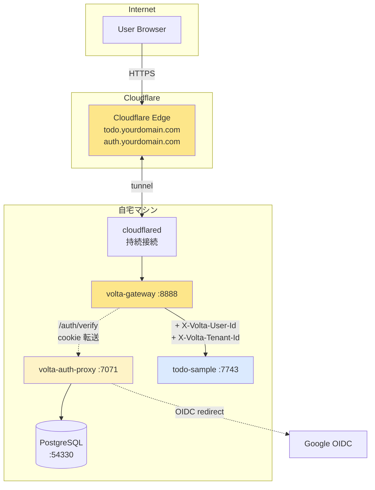
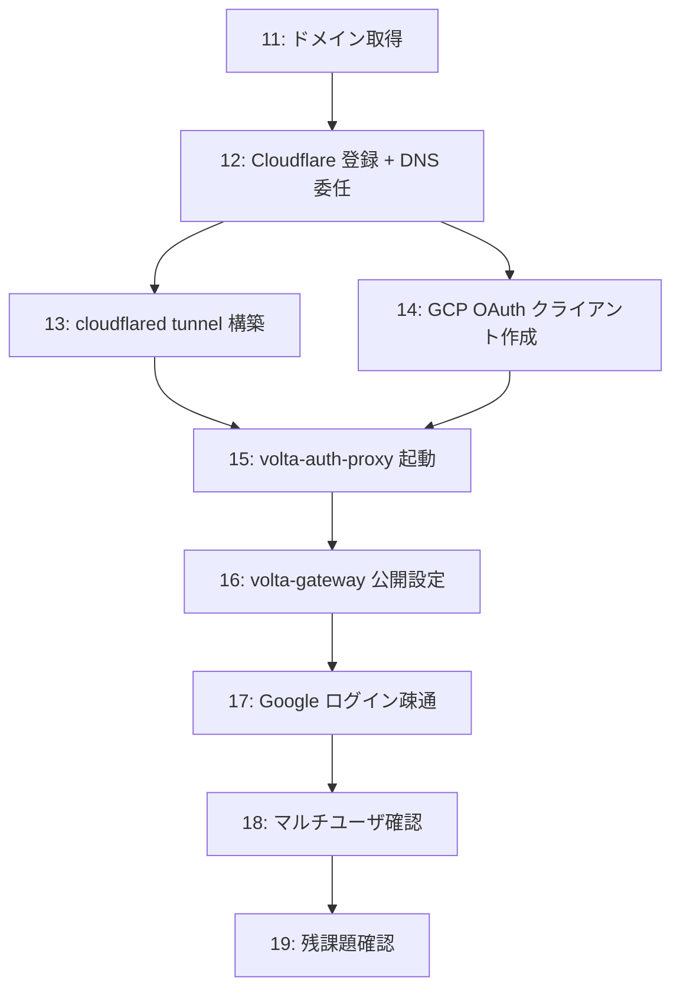

# 10 — 本物編はじめに: 全体構成と参加者がやることリスト

## 対話

> **後輩**「mock で動いたので満足してました。でも、これってまだ `localhost` の中だけですよね?」

> **先輩**「そう。だが**やっていることは本物と同じ配管**。本物編で変わるのは:」

| 観点 | mock 編 | 本物編 |
|---|---|---|
| 認証 backend | mock\_auth (固定値) | volta-auth-proxy + Google OIDC |
| 入口 | `http://localhost:8888` | `https://todo.yourdomain.com` |
| TLS | なし | Cloudflare で自動 |
| ネットワーク | 1 ホスト全部 | 自宅マシンを Cloudflare Tunnel で公開 |
| ユーザ | mock\_auth が返す `bench-user-001` 固定 | 本物の Google アカウント (自分含む) |

## なぜこの構成 (Cloudflare Tunnel) か

> **後輩**「自宅で動かすって、ルータでポート開けるんですか?」

> **先輩**「**やめろ**。Cloudflare Tunnel 使う。」

### Cloudflare Tunnel が嬉しい理由

```mermaid
flowchart LR
    subgraph 従来 (ポート開放)
        I1[Internet] -->|443/tcp| R[ルータ]
        R -->|port forward| H1[自宅マシン]
        I1 -.->|スキャン / 攻撃| H1
    end
    subgraph Cloudflare Tunnel
        I2[Internet] -->|HTTPS| CF[Cloudflare]
        H2[自宅マシン] -.->|outbound TLS<br/>持続接続| CF
        I2 -.->|❌ 自宅 IP 不明| H2
    end
    style H1 fill:#fecaca
    style H2 fill:#dbeafe
```

| メリット | 説明 |
|---|---|
| **ポート開放不要** | ルータ設定ゼロ |
| **自宅 IP 隠れる** | 全リクエストは CF 経由 |
| **NAT/CGNAT で OK** | アウトバウンド接続だけで成立 |
| **TLS は CF が終端** | 証明書管理いらない |
| **DDoS は CF が吸収** | 自宅回線が落ちない |
| **完全無料** | 個人利用 |

> **後輩**「デメリットは?」

> **先輩**「**遅延が CF 経由になる**。リアルタイム性が要るゲームサーバとかには向かない。
> 認証付き web app なら誤差レベル。」

## 全体構成 (もう一度)



ホスト名と用途:
- `auth.yourdomain.com` → cloudflared → **volta-auth-proxy** (ログイン画面 + OIDC callback)
- `todo.yourdomain.com` → cloudflared → **volta-gateway** (todo アプリ入口)

## 参加者がやることリスト



`13` と `14` は並行可能 (DNS 反映待ちの間に GCP やる、など)。

## 章ごとの「終わったかチェック」

- [ ] **11** `dig yourdomain.com` で自分の権威 DNS が出る
- [ ] **12** `dig yourdomain.com NS` が Cloudflare の nameserver
- [ ] **13** `cloudflared tunnel list` で自分の tunnel が ACTIVE
- [ ] **14** GCP に OAuth クライアントができて、リダイレクト URI に `https://auth.yourdomain.com/callback` が登録済み
- [ ] **15** `curl https://auth.yourdomain.com/healthz` が `{"status":"ok"}`
- [ ] **16** `curl https://todo.yourdomain.com/healthz` が 200 か 401
- [ ] **17** ブラウザで `https://todo.yourdomain.com` → Google ログイン → todo 作成成功
- [ ] **18** 別 Google アカウントでログインしても自分の todo は見えない

## 失敗しやすいポイント (先に警告)

> **先輩**「**ここで詰む人がよく出る** 5 つを先に言っとく:」

1. **DNS 反映待ち** — Cloudflare に委任した直後は伝播してない。`dig` で確認するまで進むな
2. **OAuth redirect URI のタイポ** — `https` を `http` にしただけで Google は弾く
3. **cookie domain ミスマッチ** — `auth.yourdomain.com` と `todo.yourdomain.com` で
   cookie を共有するには `.yourdomain.com` ドメインを指定する必要がある
4. **JWT 鍵を間違える** — 公開鍵と秘密鍵を反対に入れた、改行が消えた、など
5. **cloudflared tunnel の hostname と DNS レコードの不整合** — tunnel に向けたつもりが
   別のレコードを上書きしてた

各章で「**詰みポイント**」セクションを設けて対処法を書く。

## 次

→ [21-ドメイン取得.md](21-ドメイン取得.md)
