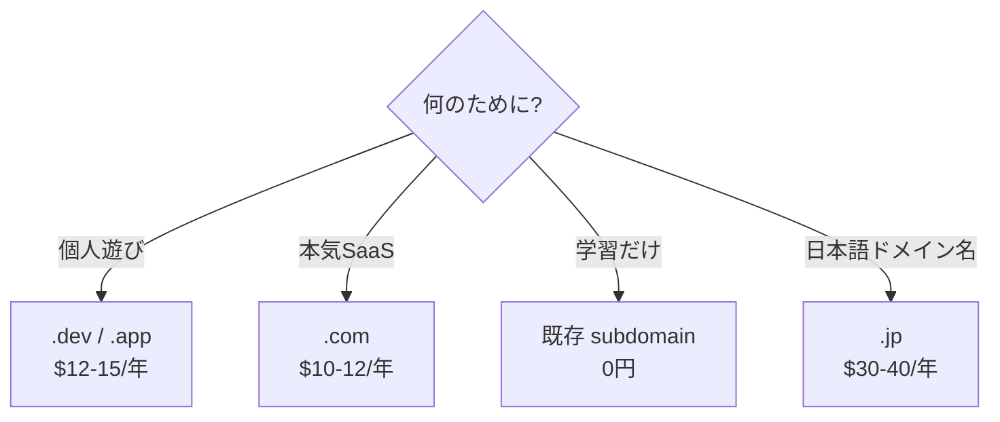

# 11 — ドメイン取得

## 対話

> **後輩**「ドメインって、もう持ってる人は飛ばしていいですか?」

> **先輩**「いい。`yourdomain.com` を **自分が管理してる** ことが必要なだけ。
> **既存ドメインの subdomain でも OK** だ。例: 既に持ってる `example.com` の
> `auth.example.com` と `todo.example.com` を使う、とか。」

> **後輩**「初めて買う人は?」

> **先輩**「**Cloudflare Registrar が一番安い** (原価). お勧め。」

## どこで買うか

| サービス | TLD 例 | 年額 (.com) | 特徴 |
|---|---|---|---|
| Cloudflare Registrar | `.com / .dev / .app` | 約 \$10 | **原価で売る (マークアップ無し)**。後で CF DNS に委任する手間ゼロ |
| Google Domains (now Squarespace) | 多数 | 約 \$12 | UI 親しみやすい |
| Namecheap | 多数 | 約 \$8 (初年) | 初年は安いが更新で値上がり |
| お名前.com | `.com / .jp` 含む | 約 1,200 円 (初年) | 日本語 UI、押し売りに注意 |
| ムームードメイン | `.com / .jp / .moe` 等 | 約 1,500 円 | 日本語 UI、シンプル |

> **後輩**「`.com` じゃなきゃダメ?」

> **先輩**「ダメじゃない。`.dev` (Google 運営、強制 HTTPS) も `.app` も OK。
> **避けるべきは `.tk` `.ml` `.cf` `.ga` `.gq`** (Freenom 系) — 無料だが信用ゼロで Google OAuth がエラー出すこともある。」

## 選び方の指針

## やること

### Cloudflare Registrar で買う場合 (推奨ルート)

1. https://www.cloudflare.com/ にアカウント作成 (無料)
2. Dashboard → **Domain Registration** → **Register Domains**
3. ドメイン名検索 → 利用可能なら **Purchase**
4. クレジットカード入力 → 完了

**この場合は次章 (12-Cloudflare登録) の DNS 委任が自動**。買った瞬間に DNS が CF 上に設定済みになる。

### 他のレジストラで買う場合

1. レジストラのサイトで購入
2. **WHOIS 公開情報の保護** にチェック (大抵無料、必ず ON にする)
3. 個人情報入力 → 支払い → 完了

この場合は次章で **明示的に Cloudflare に DNS 委任** する必要あり。

## 詰みポイント

### 1. 同名の `.com` を取りそびれた

> **後輩**「`mycoolname.com` 取られてました!」

> **先輩**「**`.dev` か `.app` か `.io` を見てみろ**。技術系ならむしろ `.dev` の方がカッコいい。
> Google OAuth でも問題なく使える。」

### 2. WHOIS で実名と住所が世界に晒された

> **先輩**「**WHOIS Privacy** は ON。レジストラによっては有料だが、それでも年 \$1-2。
> ケチると 1 週間後にスパム電話とフィッシングメールが鬼のように来る。」

### 3. 「無料」TLD を選んでしまった

`.tk` `.ml` `.cf` `.ga` `.gq` (Freenom):
- 突然消失する事例多数
- DMARC や SPF が効かないことがある
- Google OAuth が拒否する報告あり

**学習目的でも避けろ**。

## 終了条件 (チェックリスト)

- [ ] ドメインを所有 (レジストラの管理画面で確認できる)
- [ ] WHOIS Privacy が ON
- [ ] このハンズオン用に使うドメインを決定: 例 `yourdomain.com`

以降のドキュメントでは **`yourdomain.com`** という表記で進める。自分のドメインに読み替えて。

## 次

→ [22-Cloudflare登録.md](22-Cloudflare登録.md)
