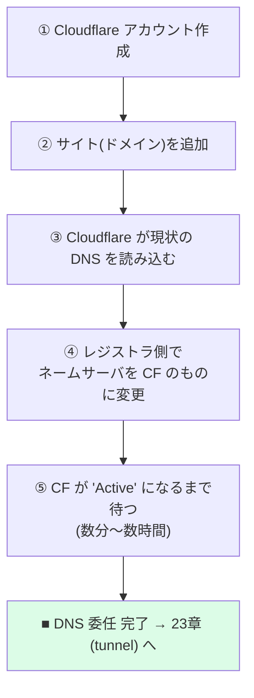

# 22 — Cloudflare 登録 + DNS 委任

## 対話

> **後輩**「ドメイン買いました。次は Cloudflare ですね。なんで Cloudflare 噛ますんでしたっけ?」

> **先輩**「2つ。**TLS を自動でやってくれる**のと、**Tunnel で自宅マシンを安全に公開**できる。
> どっちも 23 章で効いてくる。まず DNS を Cloudflare に**委任**するところまでやる。」

---

## やること全体図



---

## ① アカウント作成

[dash.cloudflare.com](https://dash.cloudflare.com) で sign up。メール確認まで。

## ② サイトを追加

- ダッシュボード → **Add a site** → `yourdomain.com` を入力。
- プランは **Free** で十分。

## ③ DNS レコードの確認

Cloudflare が既存の DNS を自動スキャンする。何も無ければ空でOK
(後で tunnel が CNAME を自動追加する)。

## ④ ネームサーバ変更 (委任の本体)

Cloudflare が2つのネームサーバ (例 `xxx.ns.cloudflare.com`) を提示する。
**レジストラの管理画面**でネームサーバをこの2つに置き換える。

| レジストラ | 変更場所 |
|---|---|
| Cloudflare Registrar | 自動 (同じ会社なので不要) |
| お名前.com | ドメイン設定 → ネームサーバ変更 → 「その他」 |
| Namecheap | Domain → Nameservers → Custom DNS |
| ムームードメイン | ネームサーバ設定変更 |

> **後輩**「反映ってすぐですか?」

> **先輩**「**最大 24h** と言われるが、実際は数分〜数時間。CF の画面が
> **`Active`** になったら完了。メールも来る。」

## ⑤ 確認

```bash
# CF のネームサーバが返ってくれば委任成功
dig NS yourdomain.com +short
# => xxx.ns.cloudflare.com
#    yyy.ns.cloudflare.com
```

---

## ハマりどころ

- **DNSSEC が前のレジストラで ON だと委任が壊れる**。レジストラ側で一旦 OFF にする。
- ネームサーバは**完全置換**。古いものを残すと不安定になる。

## 終了条件

- [ ] Cloudflare で `yourdomain.com` が **Active**
- [ ] `dig NS yourdomain.com` が CF のネームサーバを返す

## 次

→ [23-cloudflared-tunnel.md](23-cloudflared-tunnel.md)
