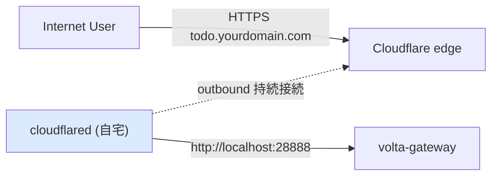

# 23 — cloudflared Tunnel 作成

## 対話

> **後輩**「いよいよ自宅マシンを公開、ですか。ルータ触らないんですよね?」

> **先輩**「触らない。**cloudflared が自宅から CF へ outbound 接続を張りっぱなし**にする。
> 外からの通信はその逆流に乗って届く。**自宅 IP は世界に晒されない**。」

---

## 仕組み



CF edge が TLS を終端し、tunnel を逆流して自宅の `cloudflared` に渡し、
そこから `localhost:28888` の gateway に流す。

---

## 手順

### ① インストール

```bash
# macOS
brew install cloudflared
# Debian/Ubuntu/WSL2
curl -L https://github.com/cloudflare/cloudflared/releases/latest/download/cloudflared-linux-amd64 -o cloudflared
sudo install cloudflared /usr/local/bin/
cloudflared --version
```

### ② ログイン (ブラウザで認可)

```bash
cloudflared tunnel login
# ブラウザが開く → yourdomain.com を選択 → 認可
# 成功すると ~/.cloudflared/cert.pem が作られる
```

### ③ tunnel 作成

```bash
cloudflared tunnel create todo-handson
# => Created tunnel todo-handson with id <TUNNEL_ID>
# 同時に ~/.cloudflared/<TUNNEL_ID>.json (認証情報) が生成される
```

### ④ config を書く

`part3/cloudflared-config.template.yml` を `~/.cloudflared/config.yml` にコピーし、
`<TUNNEL_ID>` と `yourdomain.com`、`youruser` を置換:

```yaml
tunnel: <TUNNEL_ID>
credentials-file: /home/youruser/.cloudflared/<TUNNEL_ID>.json
ingress:
  - hostname: todo.yourdomain.com
    service: http://localhost:28888
  - hostname: console.yourdomain.com
    service: http://localhost:28888
  - service: http_status:404
```

### ⑤ DNS ルートを作る (CNAME 自動追加)

```bash
cloudflared tunnel route dns todo-handson    todo.yourdomain.com
cloudflared tunnel route dns todo-handson console.yourdomain.com
```

CF DNS に `todo` / `console` の CNAME (→ tunnel) が自動で入る。

### ⑥ 起動

```bash
cloudflared tunnel run todo-handson
# Part 2 の docker compose (gateway:28888) が上がっていれば、
# これで todo.yourdomain.com が外から繋がる
```

---

## 疎通だけ先に確認

gateway が未起動でも、tunnel 自体は上がる。仮に gateway を上げて:

```bash
curl -I https://todo.yourdomain.com/login
# HTTP/2 200  ← TLS は CF が自動でやってくれている
```

> **後輩**「証明書、何もしてないのに HTTPS になってる…」

> **先輩**「**CF edge が TLS を終端**してるからな。Let's Encrypt すら自分で触らなくていい。」

---

## ハマりどころ

- `502 Bad Gateway` → gateway(:28888) が落ちてる or config の service ポート違い。
- `1033 Argo Tunnel error` → `cloudflared tunnel run` が動いてない。
- ingress の **catch-all (`http_status:404`) を消すと全部エラー**。必須。

## 終了条件

- [ ] `cloudflared tunnel run` が起動し続けている
- [ ] `https://todo.yourdomain.com/login` が 200 を返す (gateway 起動時)

## 次

→ [24-GCP-OAuth作成.md](24-GCP-OAuth作成.md)
