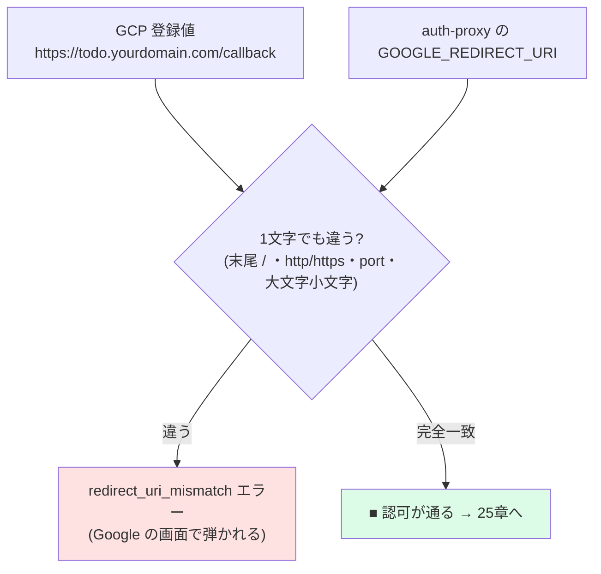

# 24 — Google Cloud で OAuth クライアント作成

## 対話

> **後輩**「やっと Google ですね。`GOOGLE_CLIENT_ID` ってどこで貰うんですか?」

> **先輩**「**GCP の OAuth クライアント**を作ると client_id / client_secret が出る。
> 一番ハマるのが **redirect_uri の完全一致**。そこだけ慎重にいけ。」

---

## auth-proxy が要求するもの

`GoogleIdp.java` のコメントどおり、必要なのは3つ:

| env | 何 | 例 |
|---|---|---|
| `GOOGLE_CLIENT_ID` | OAuth クライアント ID | `xxxx.apps.googleusercontent.com` |
| `GOOGLE_CLIENT_SECRET` | クライアントシークレット | `GOCSPX-...` |
| `GOOGLE_REDIRECT_URI` | 認可後の戻り先 | `https://todo.yourdomain.com/callback` |

auth-proxy は scope `openid email profile`、PKCE (S256)、nonce 付きで認可 URL を作る
(`GoogleIdp.buildAuthorizationUrl`)。なので GCP 側で特別な scope 設定は不要。

---

## 手順

### ① プロジェクト作成

[console.cloud.google.com](https://console.cloud.google.com) → 上部のプロジェクト選択 →
**New Project** → 名前 `todo-handson` → Create。

### ② OAuth 同意画面 (consent screen)

**APIs & Services → OAuth consent screen**:

- User Type: **External**
- App name: `todo handson` / サポートメール: 自分
- **Test users** に自分(と試す人)の Gmail を追加
  → これで「未審査アプリ」でもテストユーザはログインできる。

> **後輩**「審査いるんですか?」

> **先輩**「**ハンズオンは Testing のままでいい**。Test users に入れた数人だけ使える。
> 不特定多数に公開するときだけ Google の審査(Publish)が要る。」

### ③ 認証情報 (OAuth client ID)

**APIs & Services → Credentials → Create Credentials → OAuth client ID**:

- Application type: **Web application**
- Name: `todo-handson-web`
- **Authorized redirect URIs** に **完全一致**で追加:

  ```
  https://todo.yourdomain.com/callback
  ```

- Create → **client_id と client_secret が表示される** → 控える。

---

## redirect_uri 完全一致の罠



よくある不一致:
- 末尾スラッシュの有無 (`/callback` と `/callback/`)
- `http` と `https`
- `todo.yourdomain.com` と `www.todo...` / apex ドメイン違い

---

## 終了条件

- [ ] OAuth 同意画面が External / Testing、Test users に自分の Gmail
- [ ] OAuth client (Web) を作成、redirect_uri = `https://todo.yourdomain.com/callback`
- [ ] `client_id` / `client_secret` を控えた

## 次

→ [25-volta-auth-proxy起動.md](25-volta-auth-proxy起動.md)
