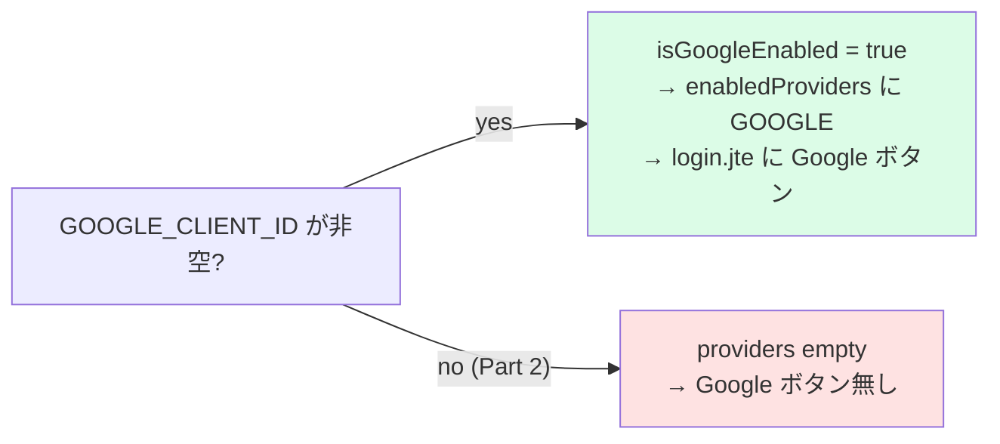

# 25 — volta-auth-proxy を本番想定で起動

## 対話

> **後輩**「client_id 貰いました。これ auth-proxy にどう食わせるんですか?」

> **先輩**「**env に入れるだけ**。`GOOGLE_CLIENT_ID` が空じゃなくなった瞬間、
> `isGoogleEnabled()` が true になって、login ページに Google ボタンが生える
> (`GoogleIdp.isEnabled` → `AppConfig.isGoogleEnabled`)。」

---

## Part 2 → Part 3 で変える env

`part3/auth-proxy-prod.env.template` を `part3/auth-proxy-prod.env` にコピーして編集。
変えるのはこの5系統:

| 項目 | Part 2 (docker) | Part 3 (本番想定) | なぜ |
|---|---|---|---|
| `BASE_URL` | `http://localhost:28888` | `https://todo.yourdomain.com` | Magic Link / redirect の生成基準 |
| `GOOGLE_CLIENT_ID/SECRET` | 無し | 24章の値 | これが入ると Google ボタンが出る |
| `GOOGLE_REDIRECT_URI` | 無し | `https://todo.yourdomain.com/callback` | GCP 登録値と完全一致 |
| `WEBAUTHN_RP_ORIGIN` | `http://localhost:28888` | `https://todo.yourdomain.com` | パスキーの origin binding |
| `DEV_MODE` | `true` | `false` | Magic Link の link をレスポンスに返さない=本番挙動 |



> Phase 図でいうと [91-認証フロー詳細図.md](91-認証フロー詳細図.md) の **Phase A** で
> `providers` が空 → 非空に変わる、という話。

---

## compose に Part 3 設定を食わせる

Part 2 の `docker-compose.yml` を流用し、auth-proxy の env_file と
マウントする config を Part 3 用に差し替える。compose override が楽:

`docker-compose.part3.yml` (例):

```yaml
services:
  auth-proxy:
    env_file:
      - ./dev/auth-proxy-dev.env          # 秘密(JWT 鍵)は流用
      - ./part3/auth-proxy-prod.env       # Part 3 の上書き
    volumes:
      - ./part3/volta-config-prod.yaml:/app/volta-config.yaml:ro
  gateway:
    volumes:
      - ./part3/todo-gateway-prod.yaml:/etc/volta/todo-gateway.yaml:ro
```

起動:

```bash
docker compose -f docker-compose.yml -f docker-compose.part3.yml up --build -d
```

23章の `cloudflared tunnel run` も別ターミナルで起動しておく。

---

## 起動確認

```bash
# 公開ドメイン経由で login ページが 200
curl -s -o /dev/null -w '%{http_code}\n' https://todo.yourdomain.com/login   # 200

# Google ボタンが描画されているか (HTML に provider リンクが出る)
curl -s https://todo.yourdomain.com/login | grep -o 'provider=GOOGLE'        # provider=GOOGLE
```

`provider=GOOGLE` が grep で引っかかれば、Google ボタンが出ている。

---

## ハマりどころ

- **Google ボタンが出ない** → `GOOGLE_CLIENT_ID` が空 or env_file の読み順で上書きされてない。
  `docker compose exec auth-proxy printenv GOOGLE_CLIENT_ID` で確認。
- **`/login` が 502** → cloudflared か gateway が落ちてる (23章のハマりどころ)。

## 終了条件

- [ ] `https://todo.yourdomain.com/login` が 200
- [ ] login ページに **Google でログイン** ボタンが出る

## 次

→ [26-volta-gateway公開設定.md](26-volta-gateway公開設定.md)
