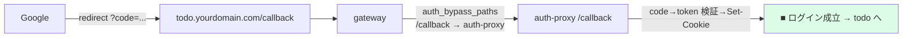
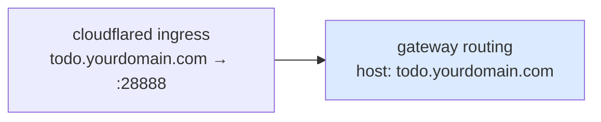

# 26 — volta-gateway をドメイン公開設定にする

## 対話

> **後輩**「auth-proxy は Google 対応しました。gateway 側は何を変えるんです?」

> **先輩**「**routing の host だけ**。`localhost` を `todo.yourdomain.com` に変える。
> あとは Part 2 と同じ。gateway は host 名で backend を振り分けてるからな。」

---

## 変えるのは host だけ

`part3/todo-gateway-prod.yaml` (テンプレは `*.template.yaml`):

```diff
 routing:
-  - host: localhost
+  - host: todo.yourdomain.com
     backend: http://todo-sample:27743
     app_id: app-todo
     auth_bypass_paths:
       - { prefix: /login,    backend: http://auth-proxy:27070 }
       - { prefix: /callback, backend: http://auth-proxy:27070 }   # ← Google の戻り先
       ...
-  - host: console.localhost
+  - host: console.yourdomain.com
     backend: http://console:80
     app_id: app-console
     public: true
```

## なぜ /callback が auth-proxy に行く必要があるか



`/callback` は **todo-sample ではなく auth-proxy が処理する**。
gateway の `auth_bypass_paths` で `/callback → auth-proxy` に上書きしているのがその配管。
ここが抜けると Google から戻ったとき todo-sample が `?code=...` を受けて 404 になる。

> **後輩**「gateway って path で振り分けできないって言ってましたよね?」

> **先輩**「**同一 host の通常 routing は 1 host=1 backend**。
> ただし `auth_bypass_paths` だけは prefix で backend 上書きできる例外。
> auth 系のパス(`/login` `/auth` `/callback` `/api` `/css`...)を auth-proxy に逃がすための仕組み。」

---

## cloudflared との関係

23章で作った ingress が
`todo.yourdomain.com → localhost:28888 (gateway)` を繋ぐ。
gateway はそこに来た **Host ヘッダ** を見て上の routing で振り分ける。
だから cloudflared と gateway の host 名は揃っている必要がある。



## 確認

```bash
# Host ごとに振り分く: todo は要認証なので未ログインだと /login へ
curl -s -o /dev/null -w '%{http_code} %{redirect_url}\n' https://todo.yourdomain.com/todos
# 302 .../login など (未認証で弾かれていればOK)
```

## 終了条件

- [ ] gateway の routing host が `todo.yourdomain.com` / `console.yourdomain.com`
- [ ] cloudflared ingress の hostname と一致している
- [ ] `/callback` が auth_bypass_paths に入っている

## 次

→ [27-Google-Login疎通.md](27-Google-Login疎通.md)
