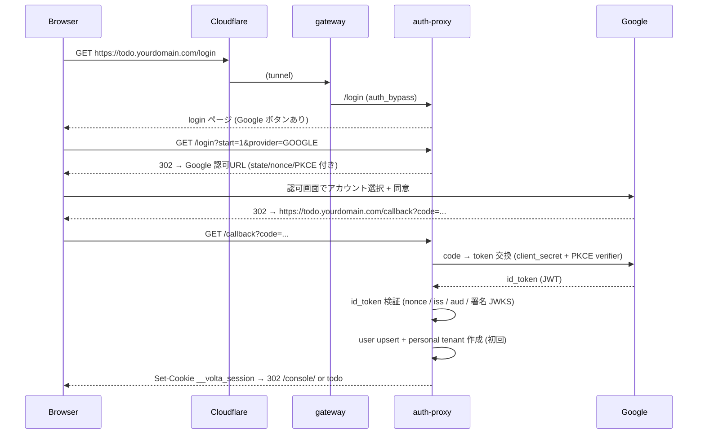

# 27 — Google ログイン疎通

## 対話

> **後輩**「全部繋がりました。ついにブラウザで Google ログインですか!」

> **先輩**「やってみろ。**Part 2 で curl でやってた Magic Link の配管**と
> 出口は同じ (Set-Cookie → todo)。入口が Google に変わっただけだ。」

---

## フル疎通の流れ



---

## ブラウザで実演

1. `https://todo.yourdomain.com/login` を開く
2. **「Google でログイン」** を押す
3. Google の画面で **Test users に入れた自分の Gmail** を選ぶ
4. 戻ってきてログイン完了 → todo が触れる

> **後輩**「`prompt=select_account` 付いてるからアカウント選択が毎回出るんですね。」

> **先輩**「そう (`GoogleIdp` で固定)。複数 Google アカウント持ってる人が
> 意図せず別アカで入るのを防げる。」

---

## ログインできたか curl で裏取り

ブラウザの DevTools で `__volta_session` cookie をコピーして:

```bash
COOKIE='__volta_session=xxxxxxxx'

# auth-proxy が gateway に返す X-Volta-* (本物の Google identity 由来)
curl -s -D - -H "Cookie: $COOKIE" https://todo.yourdomain.com/auth/verify | grep -i '^x-volta'
# X-Volta-User-Id: ...
# X-Volta-Email: you@gmail.com        ← Google の本物メール
# X-Volta-Tenant-Id: ...
# X-Volta-Roles: OWNER

# todo も作れる
curl -s -H "Cookie: $COOKIE" -X POST -H 'Content-Type: application/json' \
     -d '{"title":"Google で入って作った todo"}' https://todo.yourdomain.com/todos
```

`X-Volta-Email` が**自分の本物の Gmail** になっていれば、
Part 2 の mock / Magic Link と違って **本物の Google identity** で認証できている。

---

## ハマりどころ

| 症状 | 原因 |
|---|---|
| `redirect_uri_mismatch` | GCP 登録値 ≠ `GOOGLE_REDIRECT_URI` (24章の罠) |
| `access_blocked: not verified` | Test users に自分の Gmail を入れてない |
| `/callback` で 404 | gateway の auth_bypass_paths に `/callback` が無い (26章) |
| 戻ってきて 403 / state エラー | cookie が落ちてる (SameSite / https でない) |

## 終了条件

- [ ] ブラウザで Google ログイン → todo 操作ができる
- [ ] `X-Volta-Email` が自分の本物の Gmail

## 次

→ [28-マルチユーザ確認.md](28-マルチユーザ確認.md)
