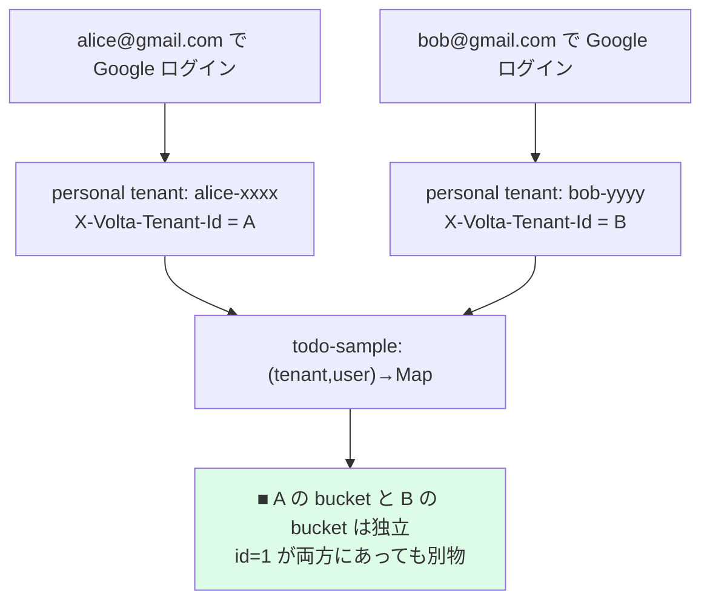

# 28 — マルチユーザでテナント分離を実証

## 対話

> **後輩**「自分は入れました。他の人が入ったらどうなるんですか? データ混ざります?」

> **先輩**「**混ざらない**。Magic Link のときと同じで、初回ログインで
> **その人専用の personal tenant** が作られる。todo-sample は
> `(tenant, user)` をキーに bucket を分けてるから、別人のは見えない。」

---

## 分離の仕組み (Part 2 の復習)



---

## やってみる

2人分の Google アカウント (or 別ブラウザ / シークレットウィンドウ) でログインし、
それぞれの `__volta_session` cookie を取る。

```bash
ALICE='__volta_session=aaaa'   # alice@gmail.com でログインした cookie
BOB='__volta_session=bbbb'     # bob@gmail.com でログインした cookie

# それぞれ todo を作る
curl -s -H "Cookie: $ALICE" -X POST -H 'Content-Type: application/json' \
     -d '{"title":"alice の秘密"}' https://todo.yourdomain.com/todos
curl -s -H "Cookie: $BOB"   -X POST -H 'Content-Type: application/json' \
     -d '{"title":"bob の秘密"}'   https://todo.yourdomain.com/todos

# alice には alice のしか見えない
curl -s -H "Cookie: $ALICE" https://todo.yourdomain.com/todos
# [{"id":1,"title":"alice の秘密",...}]
curl -s -H "Cookie: $BOB"   https://todo.yourdomain.com/todos
# [{"id":1,"title":"bob の秘密",...}]   ← id=1 だが中身が違う = 別 bucket
```

> **後輩**「Google 由来でも Magic Link と全く同じ結果ですね。」

> **先輩**「**そこが大事**。認証方式 (Magic Link / Passkey / Google) が違っても、
> 出口の `X-Volta-Tenant-Id / User-Id` は同じ形。だから **アプリ(todo-sample)は
> 認証方式を一切知らなくていい**。Part 1 でやった『ヘッダだけ読む』が最後まで効いてる。」

---

## 各ユーザの identity を覗く

```bash
for who in "$ALICE" "$BOB"; do
  curl -s -D - -H "Cookie: $who" https://todo.yourdomain.com/auth/verify | grep -iE '^x-volta-(email|tenant-id)'
  echo "---"
done
# X-Volta-Email: alice@gmail.com / X-Volta-Tenant-Id: A
# X-Volta-Email: bob@gmail.com   / X-Volta-Tenant-Id: B
```

## 終了条件

- [ ] 2 アカウントが別 tenant になっている (`X-Volta-Tenant-Id` が異なる)
- [ ] 互いの todo が見えない

## 次

→ [29-本番運用に向けた残課題.md](29-本番運用に向けた残課題.md)
