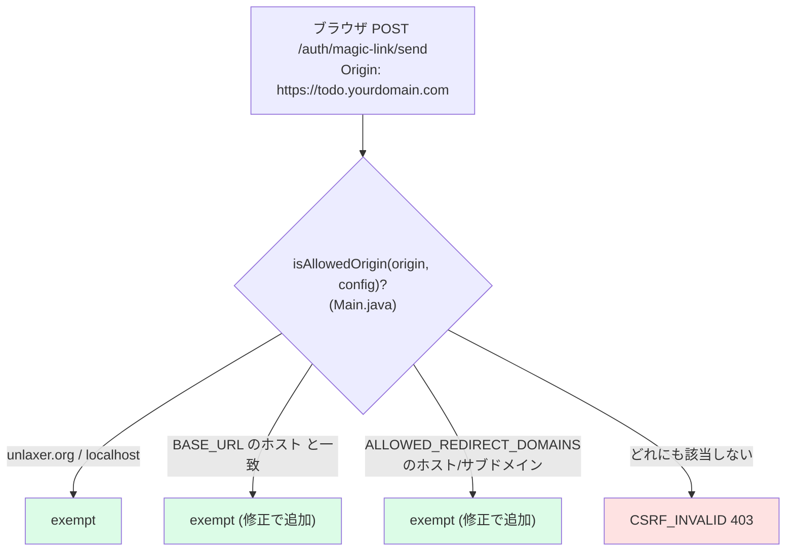
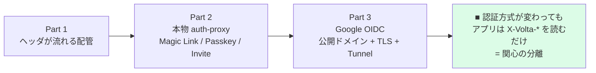

# 29 — 本番運用に向けた残課題

## 対話

> **後輩**「動きました! これもう本番で使えますよね?」

> **先輩**「**使えない**。ハンズオンは『配管が通る』までだ。
> ここから先、**本番に出すなら潰すべき穴**を正直に並べる。知っておくのが大事。」

---

## 優先度つき残課題

| 優先 | 項目 | 今の状態 | やること |
|---|---|---|---|
| 🔴 高 | 秘密の管理 | env / `dev/*.pem` が平文 | Secret Manager / SOPS。`client_secret` と JWT 鍵を git から隔離 |
| 🔴 高 | DB | docker の単一 Postgres | managed DB + 定期バックアップ + PITR |
| 🔴 高 | Google 審査 | Testing (test users のみ) | 不特定多数公開なら OAuth consent を Publish + 審査 |
| ✅ 済 | Magic Link のブラウザフォーム | 以前はカスタムドメインで CSRF に弾かれた | `isAllowedOrigin` を `BASE_URL` / `ALLOWED_REDIRECT_DOMAINS` 対応に修正済 (下記) |
| 🟡 中 | RBAC | personal tenant=OWNER 固定 | ロール設計 (MEMBER/ADMIN/OWNER) と招待フロー (15章) を運用に乗せる |
| 🟡 中 | 監視 / ログ | pretty ログを標準出力 | 構造化ログ + メトリクス + 認証失敗の検知 |
| 🟡 中 | レート制限 | `RateLimiter` に基本値あり | 公開後の閾値調整 (magic-link/send 等) |
| 🟢 低 | JWT 鍵ローテーション | 固定鍵 | kid 付き鍵の定期ローテーション |
| 🟢 低 | メール送信 | mailpit (開発用) | SES / SendGrid 等の実 SMTP |

---

## Magic Link のブラウザフォームと CSRF (修正済)

Part 2 で追加した **login ページの Magic Link メールフォーム**は、以前は
`localhost` でしか CSRF を通過しなかった。`Main.isAllowedOrigin` が
`unlaxer.org` / `localhost` 決め打ちで、カスタムドメインの Origin を弾いていたため。
**今回 `BASE_URL` のホストと `ALLOWED_REDIRECT_DOMAINS` も許可 origin に含めるよう修正した。**

- これで `part3/auth-proxy-prod.env` に `ALLOWED_REDIRECT_DOMAINS=todo.yourdomain.com,yourdomain.com`
  を入れておけば、**カスタムドメインでもブラウザの Magic Link フォームが通る**。
- なお **Part 3 の主役は Google ログイン** (GET ベースの OIDC リダイレクト) で、元々
  この CSRF チェックには引っかからない。修正の恩恵を受けるのは Magic Link / パスキー登録など POST 系。

> **後輩**「Part 2 で直した鶏卵問題が、公開ドメインだとまた別の壁(CSRF)に当たってたんですね。」

> **先輩**「そう。**localhost は WebAuthn も CSRF も特別扱い**で緩い。本番ドメインは厳しくなる。
> 今回はそこを env で開けられるようにした。許可 origin を広げすぎないのがセキュリティ上は大事だから、
> `ALLOWED_REDIRECT_DOMAINS` に**必要なドメインだけ**書くこと。」

---

## DEV_MODE を切った影響 (Part 3 では false)

| 挙動 | DEV_MODE=true (Part2) | DEV_MODE=false (Part3) |
|---|---|---|
| Magic Link の link | レスポンスに返る (curl で取れた) | **返らない**。メール必須 |
| 実演 | curl で完結 | 実 SMTP / mailpit が要る |

13章の「curl で token を取る」手口は **Part 3 では使えない**。本番挙動だから当然。

---

## まとめ: このハンズオンで体得したこと

> **先輩**「最初から最後まで一貫してるのは **『アプリは認証を知らない』**。
> mock でも Google でも、todo-sample は `X-Volta-Tenant-Id / User-Id` を読むだけ。
> この分離が出来てれば、認証は後から強くしていける。**それが今日の本題**だった。」

> **後輩**「ヘッダ2行読むだけのアプリが、最後は本物の Google 認証で動いてる…
> 配管って大事ですね。」

---

## 終了条件 (Part 3 完了)

- [ ] 公開ドメインで Google ログイン → todo 操作
- [ ] マルチユーザでテナント分離を確認
- [ ] 本番に出す前に潰すべき穴 (上表) を把握した

これで全 3 Part 完走。おつかれさま。
