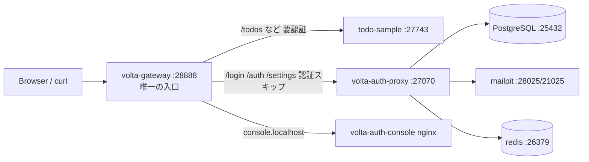

# 90 — 全体の起動方法 & 品質調査メモ (2026-06-22)

このハンズオン (Part 2 / docker-compose 一発起動) を動かして、ブラウザの
ログイン画面まわりの品質を点検したときのメモ。**「動かし方」+「何が悪くて何を直したか」**
をまとめてある。次に触る人 (=未来の僕) が同じところで詰まらないように。

---

## 1. 全体構成 (Part 2)



- **外に開くのは `:28888` (gateway) だけ。** auth-proxy の `:27070` は docker 内部のみ。
  → ブラウザは必ず `http://localhost:28888/...` 経由で触る。
- ソースは `docker-compose.yml` の `AUTH_PROXY_SRC`(既定 `../../AskOS-workspace/volta-auth-proxy`)
  からビルドする。Maven Central の `org.unlaxer:tramli` を解決して fat jar を作る完全自己完結ビルド。

| サービス | 入口 URL | 用途 |
|---|---|---|
| todo-sample | http://localhost:28888/ | 対象アプリ (ヘッダを信頼するだけ) |
| auth-proxy /login | http://localhost:28888/login | ログイン画面 |
| auth-proxy /settings/security | http://localhost:28888/settings/security | **パスキー登録**・TOTP 設定 (要ログイン) |
| console (admin) | http://console.localhost:28888/ | 管理 SPA |
| mailpit | http://localhost:28025/ | 届いたメールを見る |

---

## 2. 起動手順

```bash
cd auth-integration

./setup.sh                 # ① 兄弟ディレクトリに 4 repo を clone (冪等)
./dev/gen-dev-env.sh       # ② JWT 鍵 + dev/auth-proxy-dev.env を生成 (冪等)
docker compose up --build  # ③ ビルド + 起動 (初回は maven/rust ビルドで数分)

# 全部 healthy になったらブラウザで
open http://localhost:28888/login
```

`docker-compose.yml` は兄弟ディレクトリ (`../volta-gateway` 等) を build context にするので、
`setup.sh` で兄弟に clone しておくのが前提 (詳細は README「準備」)。

落ちたときの定石:
- `docker compose ps` で unhealthy を特定 → `docker compose logs <service>`。
- auth-proxy はマイグレーション込みで起動に数十秒かかる (`start_period: 90s`)。
- 作り直したいとき: `docker compose down -v` (←`-v` で Postgres ボリュームも消える)。

---

## 3. 今回の品質調査 — 症状 → 原因 → 対処

ブラウザで `/login` を開いたら **「Google ボタンが出ない」「パスキーの種類が少ない
(OS のダイアログの選択肢が少ない)」** で品質が低かった。掘った結果、根っこは4つ。

> フロー全体を phase/state 別の図で追いたいときは
> **[91-認証フロー詳細図.md](91-認証フロー詳細図.md)**（「○○が empty だから○○が出ない」レベルの Mermaid）を参照。

### ① 【実バグ・修正済】パスキーが必ず失敗する — WebAuthn origin 不一致

- docker の入口は `:28888` なのに、`WEBAUTHN_RP_ORIGIN` がどの env にも無く
  **`AppConfig` の既定 `http://localhost:7070`** が使われていた (`AppConfig.java:119`)。
- ブラウザは `clientDataJSON` に **実 origin = `http://localhost:28888`** を刻んで署名する。
  サーバ側 webauthn4j は `:7070` を期待して照合するので **register/login の finish が必ず検証失敗**
  (`PasskeyRegistrationRouter.java` の `ServerProperty`)。
- パスキーが一個も保存されない → ログイン画面のパスキーも当然動かない、という連鎖。
- **対処**: `docker/auth-proxy.docker.env` に追記。

  ```env
  WEBAUTHN_RP_ID=localhost
  WEBAUTHN_RP_NAME=volta-auth (handson)
  WEBAUTHN_RP_ORIGIN=http://localhost:28888
  ```

### ② 【設計どおり・見た目だけ修正】Google ボタンが出ない

- Part 2 は外部 IdP を使わない設計。`volta-config-docker.yaml` は `idp: []`。
- さらに `VoltaConfig.hasIdpSection()` は `!idp.isEmpty()` なので**空リストだと false**、
  ENV 検出にフォールバックする (`OidcService.java:124,90`)。env に `GOOGLE_CLIENT_ID` も無いので
  enabled provider は 0 個 → **これは正しい挙動**。
- ただし旧 `login.jte` は provider が 0 でも「または」セパレータを出してから空ループしていて、
  **区切り線の下が空っぽ=画面が途中で切れてるように見えた**のが品質的に NG。
- **対処**: `@if(!providers.isEmpty())` で provider が居るときだけセパレータ+ボタンを出すよう修正。
  Google を実際に出すのは **Part 3** (GCP OAuth クライアント + env 設定)。

### ③ 【鶏卵問題・修正済】ブラウザだけでログインを開始できなかった

- 旧 `login.jte` には **Magic Link のメール入力フォームが無く**、パスキーボタンと provider ボタン
  だけだった。Part 2 は provider 0・パスキーは未登録なので、**ブラウザだけだと一歩も進めない**。
  Magic Link は curl 専用 (13章が全部 curl なのはこのため)。
- その結果 `/settings/security` の**パスキー登録画面に到達する手段が無い** → 「パスキーが使えない/
  種類が出ない」の体感に繋がっていた。登録 UI 自体は実は存在して、**この端末 / セキュリティキー /
  おまかせ の3種**を選べる (`settings/security.jte:91-99`)。足りなかったのは登録UIではなく **導線**。
- **対処**: `login.jte` に Magic Link フォームを追加。
  - 同一オリジン POST `/auth/magic-link/send` なので Origin ヘッダが付き **CSRF は exempt** される
    (`Main.java:255` の `isAllowedOrigin`)。13章で curl に `-H Origin` を付けていたのと同じ理屈。
  - `DEV_MODE=true` ではレスポンスに `link` が返るので、画面にそのまま**踏めるリンク**を表示。
  - これで「メール入力 → 即ログイン → `/settings/security` でパスキー登録 → 次回パスキーログイン」
    が全部ブラウザで完結する。

### ④ 【軽微・対応済】対応アルゴリズムが少なめ

- `pubKeyCredParams` が ES256 / RS256 の2つだけだった。**EdDSA(-8) を追加**して
  security key / 新しめの OS の対応を広げた (`PasskeyRegistrationRouter.java`)。
- 「種類が少ない」の主因は ① と ③。OS ダイアログの選択肢を増やしたいときは登録時に
  「おまかせ」(`type=any`, attachment 無指定) を選ぶと、別端末(スマホ)・セキュリティキーも出る。

---

## 4. 修正後の動作確認 (ブラウザだけで完結)

```text
1. http://localhost:28888/login を開く
2. メール欄に alice@example.com →「ログインリンクを送る」
   (DEV_MODE なので画面にリンクが出る / mailpit http://localhost:28025/ でも見れる)
3. そのリンクを踏む → /console/ にログイン
4. http://localhost:28888/settings/security へ
   → 「+ パスキーを追加」で この端末 / セキュリティキー / おまかせ を選んで登録
5. ログアウトして /login → 「🔑 パスキーでログイン」→ Face ID / Touch ID / PIN
```

curl 版 (Magic Link) は従来どおり 13章の手順で OK。

---

## 5. 変更したファイル一覧

| repo | ファイル | 変更 |
|---|---|---|
| auth-integration | `docker/auth-proxy.docker.env` | `WEBAUTHN_RP_ID/NAME/ORIGIN` 追加 (①) |
| volta-auth-proxy | `src/main/jte/auth/login.jte` | Magic Link フォーム追加・空セパレータ修正 (②③) |
| volta-auth-proxy | `src/main/resources/messages_{ja,en}.properties` | login フォーム用メッセージ追加 |
| volta-auth-proxy | `src/main/java/.../PasskeyRegistrationRouter.java` | EdDSA(-8) 追加 (④) |

> 注: `AskOS-workspace/volta-auth-proxy` と `auth-test/volta-auth-proxy` は
> **同じ remote (`opaopa6969/volta-auth-proxy`) の別チェックアウト**。修正は新しい方
> (`AskOS-workspace`, compose の既定ビルド対象) から commit & push 済み。
> `auth-test/volta-auth-proxy` は古いチェックアウトなので、使うなら `git pull` で同期する。

---

## 6. 残課題

- **Google ログイン (Part 3)**: GCP で OAuth クライアントを作り、`volta-config` / env に
  `GOOGLE_CLIENT_ID` 等を入れる。Part 3 の章 (22〜29) はまだ本文未作成。
- 本番ドメインだと WebAuthn は **HTTPS 必須**・`rpId` はドメイン (例 `example.com`)。
  `WEBAUTHN_RP_ORIGIN` も公開 URL に合わせて変える。
