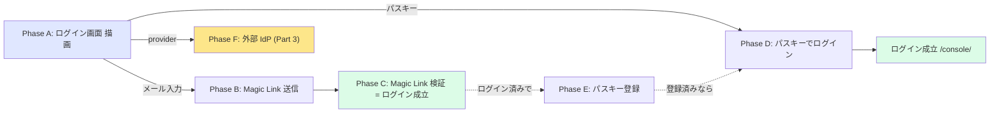
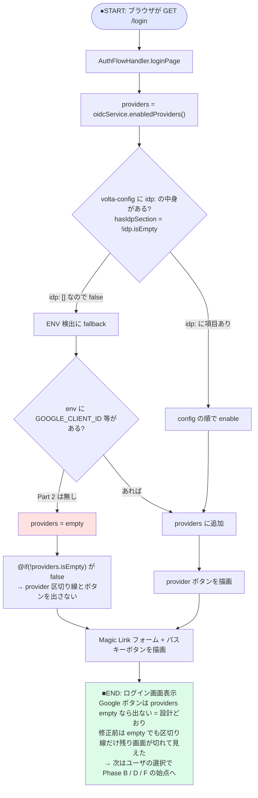
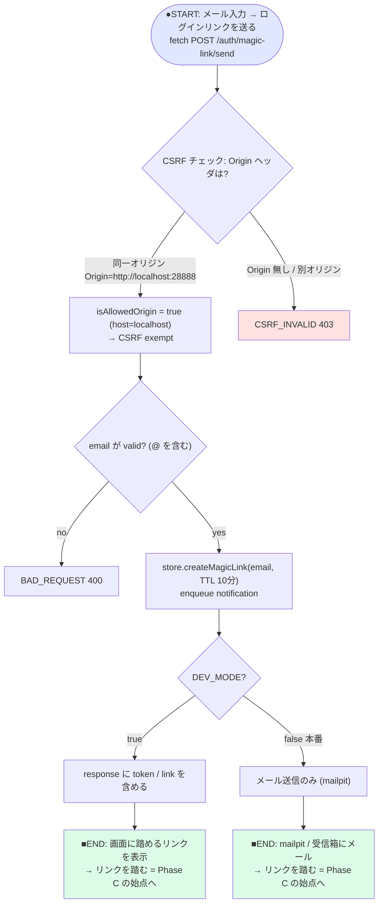
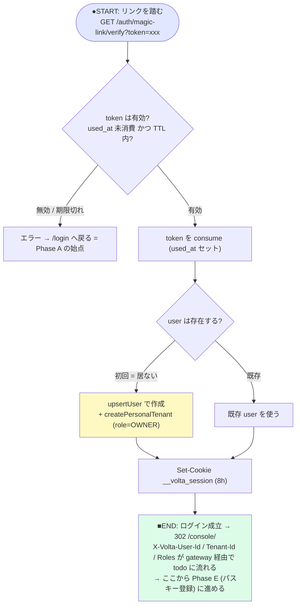
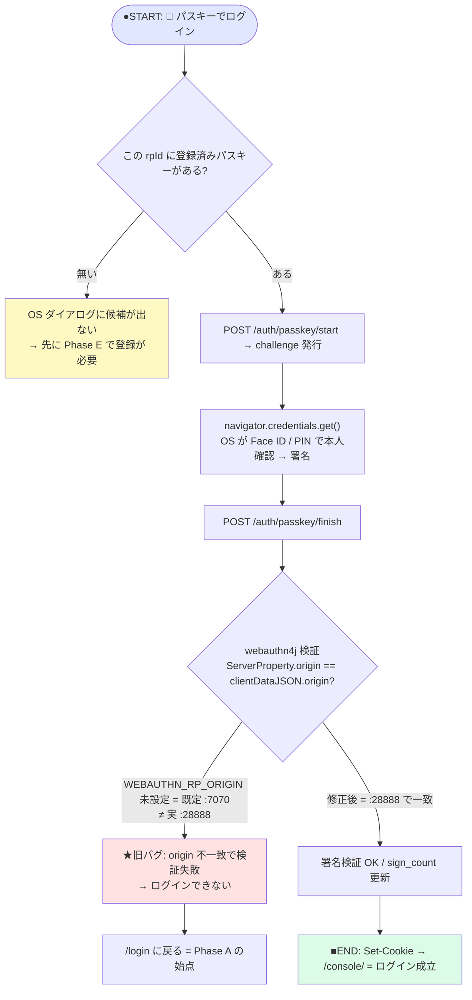
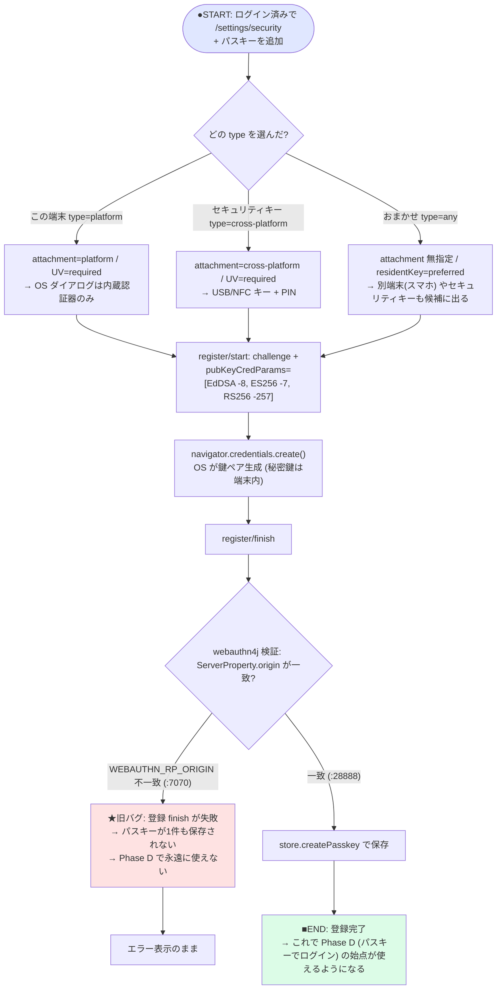
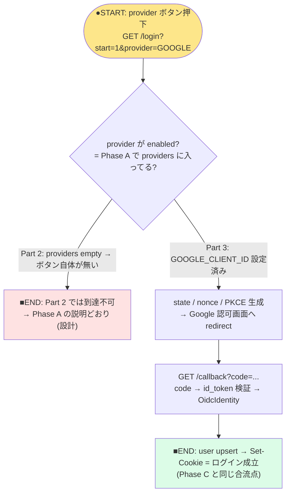

# 91 — 認証フロー詳細図 (phase/state 別 Mermaid)

[90-起動方法と品質調査メモ.md](90-起動方法と品質調査メモ.md) で見つけた品質問題を、
**「どの変数がどうなってると、どこで何がコケる/出ない」**のレベルで図にしたもの。

1枚にすると長大すぎるので **phase 単位で分割**。各図は **始点 (●START)** と **終点 (■END)** を持ち、
終点には「→ 次は Phase X の始点へ」を書いてある。下の遷移マップが全体のつなぎ。

## phase 遷移マップ

要点だけ先に:
- **Google ボタンが出ない** = Phase A で `providers` が empty (Part 2 は設計どおり)。
- **パスキーが使えない** = Phase D/E で `WEBAUTHN_RP_ORIGIN` が実 origin と不一致 → finish で検証失敗。
- **ブラウザだけで進めない** = 旧 Phase A に Magic Link フォームが無く Phase B に入れなかった (修正済)。

---

## Phase A — ログイン画面の描画 (`GET /login` → `login.jte`)

「Google ボタンが出るか」「Magic Link 欄が出るか」が決まる phase。

> ポイント: `idp: []` は「IdP を明示的に空にした」つもりでも `hasIdpSection()` が **false** に
> なって ENV 検出に落ちる (`OidcService.java:124`)。どっちにせよ Part 2 は env も空なので結果は同じ。

---

## Phase B — Magic Link 送信 (`POST /auth/magic-link/send`)

> ポイント: 同一オリジン POST だから `Origin` が自動で付く → CSRF exempt
> (13章で curl に `-H 'Origin: ...'` を付けていたのと同じ理屈, `Main.java:255`)。

---

## Phase C — Magic Link 検証 = ログイン成立 (`GET /auth/magic-link/verify?token`)

---

## Phase D — パスキーでログイン (`POST /auth/passkey/start` → `finish`)

「パスキーが使えない」の主因 (origin 不一致) がここで出る。

---

## Phase E — パスキー登録 (`/settings/security`, 要ログイン)

「パスキーの種類が少ない (OS ダイアログの選択肢)」がここの `type` で決まる。
そして登録 finish でも **同じ origin 一致が必須**。

> 「OS の選択肢が少ない」と感じたら **type=おまかせ(any)** を使う。platform 固定だと内蔵認証器しか出ない。

---

## Phase F — 外部 IdP / Google (Part 3 で実装)

> Google を出すには Part 3 で GCP の OAuth クライアントを作り、env に
> `GOOGLE_CLIENT_ID` 等を入れる (→ 章 [24](24-GCP-OAuth作成.md)/[25](25-volta-auth-proxy起動.md))。
> `GOOGLE_CLIENT_ID` が非空になると `isGoogleEnabled=true` → Phase A の `providers` に GOOGLE が入る。
