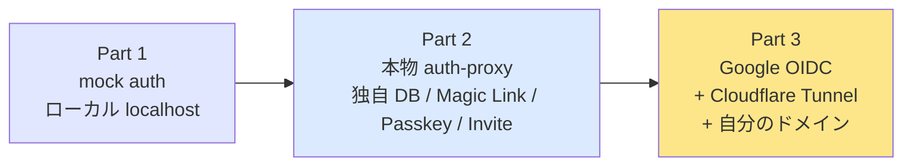
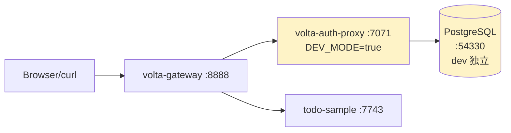
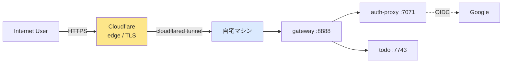

# todo-sample × volta-gateway × volta-auth-proxy 連携ハンズオン

「**ヘッダだけ読むアプリ** に、**段階的に本物の認証** を被せていく」 を end-to-end で体験するハンズオン。

対話形式 (先輩 / 後輩) + Mermaid 図 + **実際に叩いた curl ログ** で、なぜそうするか / どこを触るかを追える。

---

## 段階的構成 (3 part)

| Part | 目的 | 外部依存 | 所要時間 |
|---|---|---|---|
| **Part 1** | 配管の理解 | なし | 30 分 |
| **Part 2** | 認証 backend の動作理解 (3 方式比較) | Docker (Postgres) | 1 時間 |
| **Part 3** | 本番想定の公開構成 | ドメイン / Cloudflare / GCP | 半日 |

---

## Part 1 — 概念とローカル mock (章 00〜06)

mock の認証 backend で、**配管がどう繋がっているか** を理解する。

| # | ファイル | 内容 |
|---|---|---|
| 00 | [00-現状確認.md](00-現状確認.md) | 認証なしで動いてる todo-sample を触る |
| 01 | [01-アーキテクチャ決定.md](01-アーキテクチャ決定.md) | proxy パターン / ヘッダ信頼モデル |
| 02 | [02-todo-sample書き換え.md](02-todo-sample書き換え.md) | TodoServlet を 2 行直す |
| 03 | [03-volta-auth-proxy起動.md](03-volta-auth-proxy起動.md) | mock\_auth で代用起動 |
| 04 | [04-volta-gateway設定.md](04-volta-gateway設定.md) | YAML を書いて gateway を立てる |
| 05 | [05-疎通確認.md](05-疎通確認.md) | 3 プロセスで end-to-end curl |
| 06 | [06-振り返り.md](06-振り返り.md) | やったこと / Part 2 への橋渡し |

---

## Part 2 — 本物の auth-proxy / 独自ユーザ DB (章 10〜16)

**外部 IdP (Google など) なし** で、volta-auth-proxy 本体を立てて 3 方式の認証を試す。
**今日やる**。

| # | ファイル | 内容 |
|---|---|---|
| 10 | [10-Part2はじめに.md](10-Part2はじめに.md) | 3 認証方式の比較 / DEV\_MODE / 「signup 画面が無い」設計 |
| 11 | [11-本物auth-proxy起動.md](11-本物auth-proxy起動.md) | Postgres 起動 / JWT 鍵生成 / `.env` / 起動 / healthz |
| 12 | [12-gateway-todo連携.md](12-gateway-todo連携.md) | gateway を本物 auth-proxy に向ける |
| 13 | [13-Magic-Link認証.md](13-Magic-Link認証.md) | DEV\_MODE で curl → リンク取得 → ログイン |
| 14 | [14-Passkey認証.md](14-Passkey認証.md) | `/login` ページから WebAuthn 登録 → ログイン |
| 15 | [15-Invite認証.md](15-Invite認証.md) | admin が invitation 作成 → 招待リンク踏む |
| 16 | [16-Part2振り返り.md](16-Part2振り返り.md) | 3 方式比較表 / Part 3 への橋渡し |
| 17 | [17-docker-compose化.md](17-docker-compose化.md) | 手起動の 4 プロセスを `docker compose up` 一発に。console / mailpit も追加 |

---

## Part 3 — Google OIDC + Cloudflare Tunnel (章 20〜29)

**自分のドメイン + Cloudflare Tunnel + 本物の Google OAuth** で世界に公開する。

| # | ファイル | 内容 | 所要時間 |
|---|---|---|---|
| 20 | [20-Part3はじめに.md](20-Part3はじめに.md) | 全体構成と参加者がやることリスト | 読むだけ |
| 21 | [21-ドメイン取得.md](21-ドメイン取得.md) | ドメインを買う / 既に持ってるなら次へ | 10 分 〜 |
| 22 | [22-Cloudflare登録.md](22-Cloudflare登録.md) | Cloudflare アカウント + DNS 委任 | 15 分 |
| 23 | [23-cloudflared-tunnel.md](23-cloudflared-tunnel.md) | cloudflared インストール + tunnel 作成 | 20 分 |
| 24 | [24-GCP-OAuth作成.md](24-GCP-OAuth作成.md) | Google Cloud で OAuth クライアント作成 | 10 分 |
| 25 | [25-volta-auth-proxy起動.md](25-volta-auth-proxy起動.md) | 本番想定の設定 (固定 redirect\_uri) | 30 分 |
| 26 | [26-volta-gateway公開設定.md](26-volta-gateway公開設定.md) | ドメイン routing + CF tunnel と連携 | 15 分 |
| 27 | [27-Google-Login疎通.md](27-Google-Login疎通.md) | ブラウザで Google ログイン → todo 作成 | 10 分 |
| 28 | [28-マルチユーザ確認.md](28-マルチユーザ確認.md) | 別アカウントでテナント分離を実証 | 10 分 |
| 29 | [29-本番運用に向けた残課題.md](29-本番運用に向けた残課題.md) | RBAC / DB バックアップ / 監視 | 読むだけ |

---

## 進め方

> **後輩**「全部やるとどれくらいかかります?」

> **先輩**「Part 1 は **30 分**、Part 2 は **1 時間**、Part 3 は **半日コース**。」

> **後輩**「Part 1 飛ばしていいですか? 早く本物動かしたい」

> **先輩**「**ダメ**。Part 1 で『ヘッダが流れる仕組み』を体で理解しないと、
> Part 2 以降で session cookie のドメイン設定ミスとかで詰む。30 分の投資、リターン大。」

## 参加者前提

- マシン: Linux / macOS / WSL2
- ターミナル + テキストエディタ
- **Docker** (Part 2 で PostgreSQL)
- ブラウザ (Passkey 章はモダンブラウザ必須)
- (Part 3 のみ) クレジットカード + Google アカウント

## 関連プロジェクト

- [`todo-sample/`](../todo-sample/) — 本ハンズオンの対象アプリ (Java/Jetty)
- [`volta-gateway/`](../volta-gateway/) — Rust 製リバースプロキシ
- [`volta-auth-proxy/`](https://github.com/opaopa6969/volta-auth-proxy) — 認証 backend (Java)
- [`volta-auth-console/`](https://github.com/opaopa6969/volta-auth-console) — admin SPA (`/console`)
