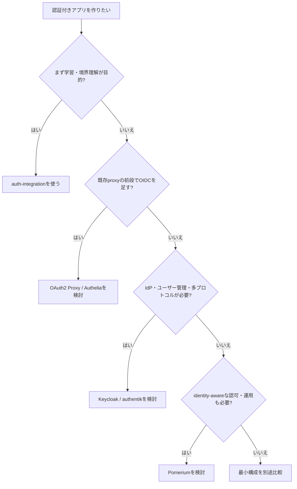

# 市場調査: auth-integration

## 0. 要約

立ち位置: 認証製品ではなく、認証を知らないアプリを localhost から公開ドメインまで導く教材・統合ワークスペースとしてニッチ優位。

最大の弱点: 4つの兄弟repo、Docker、ドメイン、Cloudflare、GCPを要求し、競合製品のクイックスタートより再現条件が重い。

次の一手: `1コマンドで成功する最小経路` と `本番で使えない範囲の明示` を先に固定し、汎用IAM製品との機能競争はしない。

## 1. このrepoは何か

一言でいえば、アプリに認証コードを書かず、gatewayが認証を終えた後の `X-Volta-*` ヘッダだけをアプリに渡す構成を、手順と実演ログで学ぶハンズオンである。READMEでは Part 1（mock）、Part 2（独自DBのMagic Link / Passkey / Invite）、Part 3（Google OIDC + Cloudflare Tunnel + 独自ドメイン）の3段階を定義している。

実装上の価値はこのrepo単体では完結しない。`setup.sh` が兄弟の `todo-sample`、`volta-gateway`、`volta-auth-proxy`、`volta-auth-console` を揃え、`docker-compose.yml` がPostgreSQL、Redis、Mailpit、認証proxy、対象アプリ、console、gatewayを接続する。したがって比較単位は「このMarkdown集」ではなく、**認証なしのサンプルアプリを、認証付き・複数ユーザー・公開ドメインまで動かす導入経路**とした。

想定利用者は、OIDCやWebAuthnを自前実装せず、言語非依存の認証境界を既存アプリの前段に置きたい開発者である。アプリ側変更は手順上2行、gatewayは唯一の公開入口、Part 1は30分、Part 2は1時間、Part 3は半日という設計になっている。

調査時点で確認できた客観指標は、トップレベルのMarkdown 28ファイル、合計3,996行、Part 1〜3の3段階、Compose上の7サービスである。repo内に自動テストは確認できず、最新HEADは `59ca758`（2026-06-22）である。これは製品の稼働品質ではなく、教材の構成量を示す数字である。

この表から、repoの成果物は「認証サーバー」より「つまずきやすい境界を順番に体験できる検証環境」に近いと読める。一方、兄弟repoのcheckout、初回ビルド、秘密生成、外部サービス設定を利用者に委ねるため、体験の再現性は製品型の競合より弱い。READMEが示す対象は明確だが、本番運用までの完了条件は29章で未完了と明記されている。

## 1.5 調査の型

`internal` と分類する。自家用に近い統合基盤・教材であり、問いは「認証市場で勝てるか」ではなく、「既製の認証製品のクイックスタートやサンプルで、これを作らずに済ませられるか」である。比較対象は同じユーザー作業（アプリを認証の前段に置き、ログイン・ヘッダ連携・公開を成立させるもの）を置き換え得る製品群にした。

この型では、repoにない機能を数えて自作を否定するのではなく、教材固有の要件で既製品が満たせない部分があるかを見る。したがって認証方式の網羅性より、最小導入、アプリ非依存性、境界の説明、local-to-publicの再現性を主軸にする。

## 2. 比較対象と選定理由

| 製品 | 何ができるか | 採用状況（2026-07-31参照） | ライセンス | うちとの決定的な違い | なぜ比較対象に選んだか |
|---|---|---|---|---|---|
| Keycloak | OIDC / OAuth / SAMLを中心とするIAM、ユーザー・クライアント管理 | ★34.9k / GitHub上の最新リリース26.6.3（2026-06-04） | Apache-2.0 | 認証基盤そのもの。教材ではなく、汎用の管理・連携面を持つ | 最も大きいOSS IAMで、既製品置換の上限を示すため |
| authentik | SAML、OAuth2/OIDC、LDAP、RADIUS等のIdP。Docker Compose / Helm等で導入 | ★22.6k / 最新リリース2026.5.2（2026-05-28） | MIT | UIでフローを構成する汎用IdP。うちの3段階ストーリーは持たない | self-hostedで小規模から大規模まで狙う直接の代替候補 |
| Authelia | reverse proxyの前段でSSO、2FA、Passkey、細粒度アクセス制御 | ★27.9k / GitHubページで取得した最終更新日は本調査では確定できず | Apache-2.0 | ForwardAuth等の既存proxy連携が中心で、独自gateway・独自DBフローではない | 「アプリを変更せず前段で守る」思想が最も近い成熟OSS |
| OAuth2 Proxy | Google、Entra、OIDC等で認証するreverse proxy / middleware。ユーザー情報をヘッダ転送 | GitHubの星数は本調査では確定できず / v7.15.1のリリース情報を確認 | MIT | 認証providerの前段に強いが、独自Magic Link / Passkey登録 / Invite管理は提供しない | うちのヘッダ連携と最小proxyの代替候補 |
| Pomerium | identity-aware / context-aware reverse proxy、VPNなしのclientless access | ★4.9k / 最新リリースv0.32.7（2026-05-07） | Apache-2.0 | 認証だけでなくゼロトラストの認可・運用を製品化。導入の抽象度が高い | gatewayを製品として置き換える比較対象 |

競合は一枚岩ではなく、Keycloak/authentikはIdP、Authelia/OAuth2 Proxyは既存proxy連携、Pomeriumはidentity-aware proxyである。つまり、うちと機能が同じ製品が一つあるのではなく、うちが手順でつないでいる複数の層を既製品が分担している。

星数と更新頻度からは、うちがコミュニティ規模で競う地図ではないと読める。特にKeycloak、authentik、Autheliaは採用判断の安心材料が大きい。うちが比較できるのは、汎用性ではなく「認証の概念を壊さずに、動くところまで案内する」導入体験である。OAuth2 Proxyの星数は確認できなかったため、採用状況の棒グラフは作らない。

## 4. 機能比較

○=ある / △=部分的・要設定 / ×=ない。重みは、◎=この立ち位置で必須、○=効く、△=あれば良い、—=不要。

| 機能 | 重み | うち | Keycloak | authentik | Authelia | OAuth2 Proxy | Pomerium |
|---|---:|---|---|---|---|---|---|
| 認証なしアプリを前段で保護 | ◎ | ○ | △ | ○ | ○ | ○ | ○ |
| アプリ側の認証コードを最小化 | ◎ | ○（ヘッダ2行の教材） | △（adapter / protocol設定） | △ | ○（proxy連携） | ○ | ○ |
| localhostから段階的に学ぶ | ◎ | ○（mock→実DB→公開） | × | △（導入例はあるが同じ段階設計ではない） | △（local composeあり） | △ | △ |
| Google / OIDC連携 | ◎ | ○（Part 3） | ○ | ○ | ○ | ○ | ○ |
| Magic Link | ○ | ○ | △（拡張・設定依存） | △（フロー構成依存） | ○（メール確認・リセット） | × | △ |
| Passkey / WebAuthn | ○ | ○ | ○ | ○ | ○ | × | △ |
| Invite / tenant参加 | ◎ | ○ | ○ | ○ | △ | × | △ |
| ヘッダでユーザー情報を渡す | ◎ | ○（gatewayがstripして再生成） | △ | △ | △（proxy構成依存） | ○ | ○ |
| 既存proxy / ingressとの統合 | ○ | ×（volta-gateway前提） | ○ | ○ | ○ | ○ | ○ |
| 本番運用の完成度（バックアップ、監視、秘密管理まで） | ◎ | ×（29章に残課題） | ○ | ○ | ○ | △ | ○ |
| 認証方式を説明する教材としての可読性 | ◎ | ○（対話・curl・Mermaid） | × | × | △ | △ | △ |

この表で痛い×は、既存proxy・ingressから自由に選べないことと、本番運用が未完了なことである。逆に、認証方式の多さは差別化ではない。Keycloakやauthentikの方が汎用性は高く、うちがPasskeyやOIDCを持つこと自体は勝ちにならない。

本当の○は、mockから本物へ、さらに公開ドメインへ進む順序と、gatewayがヘッダ信頼境界を説明する点である。既製品を採用する人には不要な手順でも、認証を「アプリ内の魔法」から「境界のある配管」に変える学習価値は残る。

## 5.5 調査者の見立て

本当の勝負所は機能数ではなく、最初の30分で「アプリは認証を知らなくてよい」「外から来たヘッダを直接信じてはいけない」を体験させられるかだと思う。ここはKeycloakやauthentikを置くだけでは自動的に得られない。

数字に出ていない懸念は、4兄弟repoのバージョン同期と、実際の手順が現在の依存先でも完走するかである。調査時点のrepo HEADは2026-06-22で、外部比較対象の更新が速い。導入教材ではこのずれが星数より大きな離脱要因になり得る（推測）。

私なら、認証製品を増やさず、まず「cloneからログイン成功まで」を再現可能な一経路に固定する。Part 3は本番製品の代わりではないと明示し、教材としての成功条件を自動検証する。

この見立てが外れるのは、利用者が学習ではなく本番の認証基盤を探している場合である。その場合は既製品の運用成熟度が勝負になり、うちの教材価値は大きく下がる。また、volta-auth-proxy / gatewayが独立した安定製品として広く採用されれば、教材ではなく統合スターターとして再評価が必要になる。

## 6. 提案（優先順）

| 順 | 提案 | 分類 | 根拠 | 最小の一手 | 効きそうな指標 |
|---:|---|---|---|---|---|
| 1 | `./setup.sh`からログイン成功までをCIでスモークテストし、対応する兄弟repoのcommit/tagを固定する | 埋める | 4節の「段階的に学ぶ」は強みだが、複数repo同期が最大の離脱要因 | compose起動、health、Magic Link、保護されたTodo取得の4ステップを自動化 | 初回成功率、手順の再現時間、失敗箇所別の件数 |
| 2 | README冒頭に「これは認証製品ではなく教材」「本番未完了」を明記し、用途別の選択分岐を置く | 伸ばす | 既製IAMとの機能競争を避け、期待値のずれを減らす | Keycloak/authentikを選ぶ条件と、このrepoを選ぶ条件を5行で追加 | READMEからの離脱率、issueの環境質問数 |
| 3 | Part 1を独立した最小Compose（兄弟clone不要）として配布し、Part 2/3を追加モジュールにする | 伸ばす | 最初の価値はmockで配管を理解すること。現状でもPart 1は外部clone不要 | Part 1用の実行確認と「次へ進む条件」を一つの入口にする | Part 1完走率、Part 2への遷移率 |
| 4 | 本番向けにSecret Manager、managed DB、バックアップ、監視、レート制限のチェックリストを成果物化する | 埋める | 29章自身が秘密、DB、監視、RBACを残課題としている | 本番非対応項目を機械可読なpreflight表にする | preflight未チェック数、本番構成での未設定数 |
| 5 | 汎用IAMの機能（SAML、LDAP、RADIUS、複雑なRBAC）を実装して対抗する | やらない | Keycloak/authentikの既存優位を薄い実装で追う車輪の再発明 | 比較表に「既製品を使うべき条件」として残す | 削減した保守コード量、教材の完走時間 |

優先順位は、まず「動く教材」であることの信頼性、次に何を置き換えるrepoなのかの説明、最後に本番へ進む際の境界の明示である。PasskeyやMagic Linkの方式追加は、既存の3方式を安定して再現できることより先には置かない。

## 7. 選択の分岐

## 8. 出典

| URL | 参照日 | 何の根拠に使ったか |
|---|---|---|
| `https://github.com/opaopa6969/auth-integration` | 2026-07-31 | repoの公開先、README・構成の確認先 |
| `https://github.com/keycloak/keycloak` | 2026-07-31 | Keycloakの機能、星34.9k、Apache-2.0、最新リリース表示 |
| `https://github.com/keycloak/keycloak/releases` | 2026-07-31 | 26.6.3（2026-06-04） |
| `https://github.com/goauthentik/authentik` | 2026-07-31 | authentikの機能、星22.6k、導入方式、ライセンス表示 |
| `https://github.com/goauthentik/authentik/releases` | 2026-07-31 | 2026.5.2（2026-05-28） |
| `https://github.com/authelia/authelia` | 2026-07-31 | AutheliaのSSO、2FA、Passkey、proxy連携、星数・Apache-2.0 |
| `https://github.com/oauth2-proxy/oauth2-proxy` | 2026-07-31 | OAuth2 Proxyのreverse proxy / middleware、OIDC provider、ヘッダ転送、MIT |
| `https://github.com/oauth2-proxy/oauth2-proxy/releases` | 2026-07-31 | v7.15.1のリリース情報 |
| `https://github.com/pomerium/pomerium` | 2026-07-31 | identity-aware reverse proxy、星4.9k、Apache-2.0、v0.32.7表示 |
| `https://www.authelia.com/` | 2026-07-31 | Autheliaの公式ドキュメント導線、Get Started / Composeの確認 |

競合repoはコードを読まず、公開README・リリースページ・公式ドキュメントだけを比較した。そのため本調査のconfidenceは「中」とした。OAuth2 Proxyの星数とAutheliaの最終更新日は、参照した公開ページから安定して確定できなかったのでnull／未確定のまま記載している。
